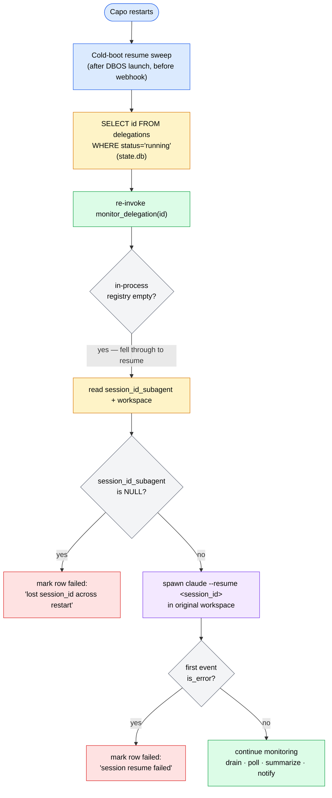

# Architecture

Capo is a single, long-lived Python 3.12 process. An inbound message arrives at the AMC webhook, is funneled onto a per-channel asyncio queue, and is handed to a Pydantic AI agent loop. Some of the agent's tools spawn long-running Claude Code subprocesses that are monitored by durable [DBOS](https://docs.dbos.dev/) workflows so they survive a process restart. State lives in two SQLite files — `state.db` (application domain) and `dbos.db` (workflow durability) — both replicated by Litestream. `launchd` supervises the process; Logfire instruments it.

This page describes the request pipeline, the boot sequence, the two-database model, restart resilience, and the eight architectural invariants that hold the design together. For the tools the agent can call (and what gets delegated to subprocesses), see [Tools & Delegation](tools-and-delegation.md); for the TOML surface that configures all of this, see [Configuration](configuration.md); for runbooks and supervision, see [Operations](operations.md).

## Request pipeline

A message flows through six stages from AMC webhook to AMC reply. The fast path (no tool call) completes inside a single agent run; the slow path forks into a durable DBOS workflow that drives a subprocess to completion and notifies the user when it finishes.

```mermaid
flowchart LR
    AMC([AMC]):::ext

    subgraph proc["Capo process"]
        direction LR
        LIS["amc_listener<br/>HMAC + DedupeLRU<br/>fast-ACK 204"]:::primary
        DISP["Dispatcher<br/>per-channel queue (≤100)"]:::primary
        WORK["ChannelWorker<br/>slash intercept · budget gate<br/>session + history"]:::primary
        AGENT["Pydantic AI agent<br/>agent.run"]:::secondary
        TOOLS["tools<br/>delegate_to_claude_code"]:::secondary
        WF["DBOS monitor_delegation<br/>drain · poll · summarize · notify"]:::workflow
        OUT["AMCClient.send<br/>Idempotency-Key + mark_read"]:::primary
    end

    SDB[("state.db")]:::store
    DDB[("dbos.db")]:::store
    INFRA["Litestream · launchd · Logfire"]:::infra

    AMC -->|"POST /amc/webhook"| LIS
    LIS -->|"enqueue(envelope)"| DISP
    DISP --> WORK
    WORK -->|"text + history + deps"| AGENT
    AGENT -->|"tool call"| TOOLS
    TOOLS -->|"spawn CC + hand off"| WF
    AGENT -->|"reply"| OUT
    WF -->|"terminal notify"| OUT
    OUT -->|"send reply"| AMC

    WORK -.->|"sessions · history · costs"| SDB
    TOOLS -.->|"delegations row"| SDB
    WF -.->|"step cache · status"| DDB
    INFRA -.->|"replicate · supervise · trace"| proc

    classDef ext fill:#f3f4f6,stroke:#6b7280,color:#000
    classDef primary fill:#dbeafe,stroke:#2563eb,color:#000
    classDef secondary fill:#f3e8ff,stroke:#7c3aed,color:#000
    classDef workflow fill:#dcfce7,stroke:#16a34a,color:#000
    classDef store fill:#fef3c7,stroke:#d97706,color:#000
    classDef infra fill:#fee2e2,stroke:#dc2626,color:#000
```

### 1. AMC inbound webhook

AMC delivers every inbound message to the FastAPI `POST /amc/webhook` endpoint in `capo/transport/amc_listener.py`. The handler reads the **raw** request body first, then performs three gates in order:

- **HMAC verification** — computes `HMAC-SHA256(webhook_secret, raw_body)` and compares it against the `X-AMC-Signature` header with `hmac.compare_digest` (constant-time). A mismatch returns `401` and the body is **never parsed or logged**.
- **Delivery-id required** — a missing `X-AMC-Delivery-Id` header returns `400 VALIDATION_ERROR`. Without it, the request cannot be deduplicated safely.
- **Dedupe** — `DedupeLRU`, a bounded `OrderedDict` with a 15-minute TTL keyed on `X-AMC-Delivery-Id`. A duplicate within the window returns `204` with **no enqueue**, so AMC's retries (~5 attempts over ~13 minutes) don't double-process a message.

### 2. Envelope parse + fast-ACK enqueue

Once the gates pass, the body is parsed with `AMCInboundEnvelope.model_validate_json(raw_body)` (a parse failure returns `400`). The envelope is handed to `dispatcher.enqueue(envelope)`, which routes it onto a per-channel `ChannelWorker` queue (maximum depth 100). The endpoint then returns `204` immediately — the worker owns the (potentially long) agent run, so the handler always returns inside the P99 < 1s webhook SLA regardless of turn duration.

!!! warning "Queue-full means silent message loss"
    `amc_listener` records the `delivery_id` in the 15-minute dedupe LRU **before** it calls `enqueue`. If the per-channel queue is full (100 entries), the envelope is dropped and the handler still returns `204`. AMC's subsequent retries carry the same `delivery_id`, hit the dedupe LRU, and are ACKed without re-attempting — so the message is lost for the remainder of the 15-minute TTL. Watch for `event=capo.listener.enqueue.full` in the logs (see [Operations](operations.md)).

### 3. Per-channel worker

`ChannelWorker._handle_envelope` in `capo/transport/dispatcher.py` is the heart of the turn pipeline. For each envelope it:

1. **Resolves the user** — `resolve_user_id(sender_id, settings)`. An unknown sender is `mark_read` and the turn returns (the agent is never invoked).
2. **Intercepts slash commands** — `parse_slash_command(text)` runs on the **raw inbound text before** `agent.run`. A match (`/status`, `/kill`, `/new`, `/clear`, `/override`, `/approve`, `/deny`, …) is handled in-process with **zero LLM tokens**, then `mark_read` and return.
3. **Checks the budget** — `check_budget(...)` is a pre-agent gate. `hard_block` refuses with a friendly reply (agent never runs); an armed `/override` consumes a sentinel and proceeds; `soft_warn` prepends a heads-up to the agent prompt.
4. **Loads session + history** from `state.db` and builds `CapoDeps`, mutating `user_id` / `thread_id` for this turn.
5. **Runs the agent** — `agent.run(text, message_history, deps)`.
6. **Persists** the new messages, **records cost** (fail-open), and **maybe compacts** (fail-open).

!!! warning "Compaction is disabled in production"
    `Dispatcher` accepts a `compaction_summarizer` keyword argument, but `capo/main.py` never passes one. Even with `[compaction] enabled = true` in your TOML, no compaction runs — the `_maybe_compact` step is a no-op because the summarizer is `None`. See [Configuration](configuration.md) for the compaction settings (and the gap).

### 4. Tool calls

During `agent.run`, the agent may call tools. The most consequential is `delegate_to_claude_code`, which spawns a Claude Code subprocess, captures its session id, writes a `delegations` row to `state.db`, and hands off monitoring to DBOS. See [Tools & Delegation](tools-and-delegation.md) for the full tool surface and the delegation lifecycle.

### 5. DBOS `monitor_delegation` workflow

`monitor_delegation` in `capo/workflows/delegation.py` is a durable DBOS workflow. It drains the subprocess's streamed output, polls its return code, computes a terminal status (`completed` / `failed` / `killed`), summarizes the result, and notifies the user. Because DBOS checkpoints each step into `dbos.db`, this work survives a process restart (see [Restart resilience](#restart-resilience)).

### 6. Reply

The reply path closes the loop: `AMCClient.send(...)` delivers the agent's response (or the workflow's terminal notification) to AMC carrying an `Idempotency-Key` header, then `mark_read` acknowledges the inbound message. Both the synchronous reply and the asynchronous workflow notification flow through the same sender.

## Boot sequence

Startup is split into a synchronous `main()` (config, agent build, smoke-test exits) and an async `amain()` (the full serving stack). Both live in `capo/main.py`.

`main()` — synchronous front half:

1. Configure logging; parse `--config` / `--no-serve` / `--version`.
2. Resolve the config path: CLI `--config` > `$CAPO_CONFIG` > `./config.toml`. An explicit-but-missing path is a hard error.
3. `Settings.load(...)` validates the TOML. A `ConfigError` prints a single line and exits `2`.
4. Bridge provider API keys from `.env` into `os.environ` so Pydantic AI's auto-resolved providers find `ANTHROPIC_API_KEY` / `OPENAI_API_KEY`.
5. `build_agent(...)` constructs the agent (SOUL + system prompt). An `AgentBuildError` exits `2`.
6. If `--no-serve`, print the banner and exit `0` (the boot smoke-test path — no sockets bound). Otherwise hand off to `asyncio.run(amain(...))`.

`amain()` — async serving stack:

1. **Binary precheck** — validate the `claude` / `codex` CLI versions before any socket opens (skippable via `boot.skip_binary_precheck`).
2. **Logfire** — `configure_logfire(settings)`. A missing `logfire` package raises `LogfireMissingError` and returns `2`; all other Logfire failures degrade gracefully and never block boot.
3. **Shared httpx client** — one `httpx.AsyncClient` per process, shared by `AMCClient` and the `fetch_url` tool.
4. **AMCClient + Dispatcher** — built with a per-turn `state.db` connection factory.
5. **FastAPI app** — `build_app(...)`, instrument it, register `GET /healthz`.
6. **DBOS** — `init_dbos(...)` validates that `dbos_db_path` and `db_path` are different files (a collision raises `DBOSInitError`), then `launch_dbos()` opens `dbos.db` and applies DBOS's own migrations in a worker thread.
7. **Register workflow-layer callbacks** — the AMC sender adapter and the caffeinate manager.
8. **Cold-boot resume sweep** — re-invoke `monitor_delegation` for every `delegations` row still `status='running'` (see below). Runs **after** DBOS launches but **before** the webhook opens.
9. **Start workers + retention scheduler.**
10. **Boot sweep** — drain any AMC unread backlog before opening the webhook (deliver-once across restart).
11. **Serve uvicorn** until SIGINT/SIGTERM, then unwind cleanly (stop dispatcher → `destroy_dbos` → close clients).

!!! note "DBOS must be ready before the webhook opens"
    The ordering in `amain()` is deliberate: DBOS launches and the resume sweep runs while the webhook is still closed. This guarantees that by the time the first new inbound message can be accepted, every orphaned delegation already has a live monitor again.

## The two-database model

Capo keeps application state and workflow durability in **separate** SQLite files. This separation is the first architectural invariant, and `init_dbos` refuses to launch if the two paths collide.

| Database | Manager | Owns | Default path |
|---|---|---|---|
| `state.db` | Alembic | `users`, `sessions`, `conversation_history`, `delegations`, `delegation_output`, `delegation_heartbeats`, `approvals`, `costs` / `daily_costs` | `~/.capo/state.db` (`settings.paths.db_path`) |
| `dbos.db` | DBOS | Workflow status, step-result cache, workflow events | `~/.capo/dbos.db` (`settings.paths.dbos_db_path`) |

DBOS auto-applies its own schema migrations on `launch_dbos()`; `state.db` is managed with Alembic (`uv run alembic upgrade head`).

**Cross-DB references carry no foreign key.** Two pointers cross the boundary and are intentionally unenforced by SQLite:

- `approvals.workflow_id` (in `state.db`) points at a DBOS workflow id (in `dbos.db`).
- `delegations.id` (in `state.db`) is referenced by DBOS workflow arguments.

`init_dbos` resolves both paths and raises `DBOSInitError("path_collision", ...)` if they point at the same file. Never store DBOS state in `state.db` or application state in `dbos.db`.

!!! warning "Restore both databases together"
    Because the cross-DB pointers have no FK, restoring only `state.db` or only `dbos.db` from a Litestream backup leaves references dangling at non-existent rows. Always restore the pair to a consistent point in time — see the paired-restore procedure in [Operations](operations.md).

!!! note "`delegations.heartbeat_intervals_json` is vestigial"
    This column was created by migration 001 but has zero source references. It will be dropped — do not build new behavior on it.

## Restart resilience

A delegation can run for an hour or more. Capo guarantees that a coding run survives a full process restart (a reboot, a `launchd` cycle, a crash) without losing the subprocess's work.

When `delegate_to_claude_code` spawns Claude Code it writes a `delegations` row (`status='running'`, plus `session_id_subagent`, `pid`, and `workspace`) and starts a `monitor_delegation` DBOS workflow. DBOS checkpoints every step into `dbos.db`. On restart, the cold-boot resume sweep in `capo/main.py` selects all `delegations WHERE status='running'` and re-invokes `monitor_delegation` for each. The workflow re-enters, finds the in-process registry empty (it is process-local and was wiped by the restart), reads `session_id_subagent` and `workspace` from the row, and re-spawns `claude --resume <session_id_subagent>` in the original workspace.

Two failure modes are handled explicitly:

- If `session_id_subagent` is `NULL` (the crash happened before the session id was captured), the row is marked `failed` with reason `lost session_id across restart`.
- If the resumed Claude Code emits `is_error` on its first event (e.g. the session id is no longer valid), Capo **refuses to overwrite** the original `session_id_subagent` and marks the row `failed` with reason `session resume failed`.

The durability guarantee rests on DBOS idempotency keys: each side-effecting step is keyed by a SHA-256 over its deterministic arguments, so a step that completed before the crash is **replayed from `dbos.db`** rather than re-executed. That is what lets a 90-minute run pick up exactly where it left off instead of starting over.

## Architectural invariants

These eight invariants are enforced, not aspirational — most are backed by a test or a boot-time check.

| # | Invariant | What it means | How it's enforced |
|---|---|---|---|
| 1 | Two-DB separation | `state.db` (app, Alembic) and `dbos.db` (workflows, DBOS) are distinct files; cross-DB pointers carry no FK | `init_dbos` raises `DBOSInitError("path_collision")` if the paths resolve to the same file |
| 2 | Idempotency keys everywhere | Webhook dedupe on `X-AMC-Delivery-Id` (15-min LRU); side-effecting DBOS steps wrapped with `@idempotent_step`; AMC outbound sends carry an `Idempotency-Key` header | SHA-256 over deterministic step args; the same hash keys the outbound header |
| 3 | Determinism in workflows/steps | No `datetime.now()`, `uuid4()`, or env reads inside workflow or step bodies — all timestamps passed in by the caller, so replays produce identical idempotency keys | Code review + the documented single exception (a wall-clock read inside an idempotent terminal-persist step and the heartbeat elapsed-time check, both at-most-once via the wrapper) |
| 4 | Lazy imports for heavy deps | `pydantic_ai`, FastAPI, DBOS, and tool modules are imported inside functions so `--version` / `--no-serve` stay fast and test-friendly | Imports live in function bodies, not module top level |
| 5 | Dependency injection over globals | `Dispatcher`, `AMCClient`, `BootSweep`, `RetentionScheduler` accept injectable `sleep` / `monotonic` / `conn_factory` | Tests substitute fakes for clocks and connections |
| 6 | Fail-open on observability & accounting | Logfire boot failure, cost-accountant errors, and compaction errors never block the user reply | `contextlib.suppress(Exception)` + WARNING log around each non-critical step |
| 7 | Pre-agent slash intercepts | `/status`, `/kill`, `/new`, `/clear`, `/override`, `/approve`, `/deny` are parsed off the raw inbound text **before** `agent.run` — zero LLM tokens | `parse_slash_command` runs first in `_handle_envelope`; asserted by `tests/test_phase5_checkpoint.py` |
| 8 | Span taxonomy enforced via AST | Every Logfire span goes through a named constructor in `capo/observability.py` | A raw `logfire.span(` anywhere else in `capo/` fails `tests/test_span_taxonomy.py` |

---

**See also:** [Tools & Delegation](tools-and-delegation.md) for the agent's tool surface and the delegation lifecycle · [Configuration](configuration.md) for the TOML reference (including the compaction gap) · [Operations](operations.md) for supervision, the Litestream paired-restore runbook, and log-event references.
