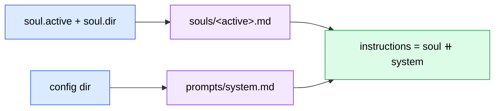

# Configuration

Capo is configured by a single TOML file (`config.toml`) plus a sibling `.env` file that holds secrets only. Both are read and validated once at boot by `Settings.load()` in `capo/config.py`. The TOML file supplies every runtime table; the `.env` file supplies the secrets (HMAC keys, bearer token, model API keys) as redacted `SecretStr` values.

!!! note "Settings are immutable at runtime"
    Settings are loaded once at boot, never mutated, and never hot-reloaded. To apply any configuration change — a model swap, a budget bump, a new user — **restart the Capo process**. There is no reload signal.

Validation fails fast: a misconfiguration produces a single-line error naming the offending key path (e.g. `amc.listen_host: ...`) and `main()` exits with code `2`. See [Getting started](getting-started.md) for the boot smoke-test workflow and [Operations](operations.md) for the production supervision and restore procedures.

## File layout

Capo expects two files side by side:

```
your-config-dir/
├── config.toml        # all runtime tables (this page)
├── .env               # secrets only — never commit
├── souls/             # soul prompt files (soul.dir, by default)
│   ├── default.md
│   └── concise.md
└── prompts/
    ├── system.md          # operational system prompt (not TOML-configurable)
    └── delegation_brief.md
```

A few resolution rules to keep in mind:

- `~` is expanded in every `[paths]` entry and in `soul.dir`.
- A relative `soul.dir` is resolved against the **parent directory of the config file**, not the process CWD.
- `[paths]` targets need not exist at validation time (they may be created at boot); `soul.dir/<soul.active>.md` **must** exist or boot fails.
- Unknown top-level TOML keys are logged as a warning and ignored (forward-compat / typo surfacing), not rejected.

!!! note "There is no example config in the repo"
    The repository ships **no** committed `config.toml`. The canonical, copy-pasteable template lives in `internal/ops/RUNBOOK.md` §2.3. The skeleton below is a condensed starting point, not a drop-in file.

### Minimal `config.toml` skeleton

This shows only the **required** sections with placeholder values. Secrets are intentionally absent — they belong in `.env`, never in TOML.

```toml title="config.toml (condensed skeleton)"
[models]
default = "anthropic:claude-sonnet-4-6"
router  = "anthropic:claude-haiku-4-5"
heavy   = "anthropic:claude-opus-4-7"

[models.subagents]
claude_code = "anthropic:claude-sonnet-4-6"
codex       = "openai:gpt-5-codex"

[paths]
workspaces_root = "~/.capo/workspaces"
projects_root   = "~/code"
db_path         = "~/.capo/state.db"
dbos_db_path    = "~/.capo/dbos.db"      # MUST differ from db_path

[soul]
active = "default"          # -> souls/default.md
dir    = "souls"            # relative to this file's directory

[amc]
base_url = "http://127.0.0.1:8080"
agent_id = "capo-1"

[agents.claude_code]
binary = "claude"

[agents.codex]
binary = "codex"

[budget]
soft_daily_usd = 5.0
hard_daily_usd = 20.0       # must be >= soft_daily_usd
notify_channel = "ops-alerts"

[shell]
allowlist = ["ls", "cat", "git", "rg"]

[concurrency]
max_delegations = 3

[approval]
timeout_seconds = 1800      # 30 minutes

[heartbeat]
intervals_seconds = [900, 3600, 14400]   # 15m / 1h / 4h

[users.stephen]
amc_senders  = ["+15555550123"]
display_name = "Stephen"

# Secrets live in .env (sibling file):
#   AMC_WEBHOOK_SECRET=...
#   AMC_BEARER_TOKEN=...
#   ANTHROPIC_API_KEY=...
```

---

## `[models]`

Required, with no defaults. Pydantic AI model IDs for the router, default, and heavy paths, plus the subagent table.

| Field | Type | Default | Required | Purpose |
|---|---|---|---|---|
| `models.default` | str | — | Yes | Pydantic AI model ID for the main router agent. |
| `models.router` | str | — | Yes | Lighter model used when the soft daily cap is crossed. |
| `models.heavy` | str | — | Yes | Heavy model for complex tasks. |
| `models.subagents.claude_code` | str | — | Yes | Model ID passed to Claude Code delegation. |
| `models.subagents.codex` | str | — | Yes | Model ID passed to Codex delegation. |

```toml title="[models]"
[models]
default = "anthropic:claude-sonnet-4-6"
router  = "anthropic:claude-haiku-4-5"
heavy   = "anthropic:claude-opus-4-7"

[models.subagents]
claude_code = "anthropic:claude-sonnet-4-6"
codex       = "openai:gpt-5-codex"
```

!!! warning "Model IDs must appear in the pricing table to be billed"
    Cost accounting only knows the Claude 4 family (see [Cost & budget](#cost-budget)). A model ID not in `PRICING_TABLE` is silently costed at **$0**, which means budget caps will never fire for it.

---

## `[paths]`

Required. On-disk locations. `~` is expanded; targets need not exist at validation time.

| Field | Type | Default | Required | Purpose |
|---|---|---|---|---|
| `paths.workspaces_root` | Path | — | Yes | Root for per-delegation git worktrees (e.g. `~/.capo/workspaces`). |
| `paths.projects_root` | Path | — | Yes | Root for user project repos (e.g. `~/code`). |
| `paths.db_path` | Path | — | Yes | Path to `state.db` (Alembic-managed). |
| `paths.dbos_db_path` | Path | — | Yes | Path to `dbos.db` (DBOS-managed). Must differ from `db_path`. |

!!! warning "Two databases, never collapsed into one"
    `dbos_db_path` **must differ** from `db_path`; boot refuses on collision. Capo keeps app domain state (`state.db`) and durable-workflow state (`dbos.db`) in separate files on purpose. Restoring only one of the two leaves cross-DB references dangling — always restore them as a pair. See [Operations](operations.md).

---

## `[soul]`

Required. Selects the active soul prompt. See [Souls & prompts](#souls-prompts) for how soul files are composed into the agent's instructions.

| Field | Type | Default | Required | Purpose |
|---|---|---|---|---|
| `soul.active` | str | — | Yes | Filename stem of the active soul (e.g. `"default"` → `souls/default.md`). |
| `soul.dir` | Path | — | Yes | Directory of soul `.md` files. Relative paths resolve against the config file's parent directory. |

!!! warning "A missing soul file aborts boot"
    The file `<soul.dir>/<soul.active>.md` must exist and be readable. If it is absent, `Settings.load()` raises a `ConfigError` naming the resolved path.

---

## `[amc]`

Required, with several optional fields. Configures the AMC transport: the outbound REST base URL and the inbound webhook listener.

| Field | Type | Default | Required | Purpose |
|---|---|---|---|---|
| `amc.base_url` | str | — | Yes | AMC REST API base URL (e.g. `"http://127.0.0.1:8080"`). |
| `amc.agent_id` | str | — | Yes | Agent ID registered with AMC. |
| `amc.listen_host` | str | `"127.0.0.1"` | No | Host the webhook listener binds. |
| `amc.listen_port` | int | `8090` | No | Webhook listener port (1–65535). |
| `amc.max_boot_wait_seconds` | int | `60` | No | How long the boot sweep waits for AMC reachability. |
| `amc.tls_cert` | Path \| None | `None` | Conditional | TLS certificate. Required when `listen_host` is not loopback. |
| `amc.tls_key` | Path \| None | `None` | Conditional | TLS private key. Required when `listen_host` is not loopback. |

```toml title="[amc]"
[amc]
base_url = "http://127.0.0.1:8080"
agent_id = "capo-1"
listen_host = "127.0.0.1"
listen_port = 8090
max_boot_wait_seconds = 60
```

!!! warning "Off-loopback binding requires TLS"
    If `listen_host` is anything other than a loopback address (`127.0.0.1`, `::1`, `localhost`), both `amc.tls_cert` and `amc.tls_key` become **mandatory**. Binding off-loopback without them fails validation at boot.

---

## `[agents]`

Required. Per-agent CLI binary configuration. Each agent block accepts extra string-valued keys that are passed through to the delegation tooling.

| Field | Type | Default | Required | Purpose |
|---|---|---|---|---|
| `agents.claude_code.binary` | str | — | Yes | Path or name of the `claude` CLI binary. |
| `agents.codex.binary` | str | — | Yes | Path or name of the `codex` CLI binary. |
| `agents.<name>.<extra>` | str | — | No | Pass-through options, e.g. `default_permission_mode`, `worktree_base_branch`, `default_sandbox`. |

```toml title="[agents]"
[agents.claude_code]
binary = "claude"
default_permission_mode = "acceptEdits"   # extra pass-through key
worktree_base_branch = "main"

[agents.codex]
binary = "codex"
```

!!! note "Extra keys are agent-specific"
    Unlike most tables, `[agents.<name>]` blocks allow extra string keys. Common pass-throughs include `default_permission_mode` (typically `"acceptEdits"`), `worktree_base_branch` (typically `"main"`), and `default_sandbox`. These are forwarded to the delegation tooling rather than validated by the config layer.

---

## `[budget]`

Required. Soft and hard daily spend caps in USD. See [Cost & budget](#cost-budget) for the runtime mechanics of each cap.

| Field | Type | Default | Required | Purpose |
|---|---|---|---|---|
| `budget.soft_daily_usd` | float (≥ 0) | — | Yes | Soft daily cap; crossing warns but still runs the turn. |
| `budget.hard_daily_usd` | float (≥ 0) | — | Yes | Hard daily cap; crossing blocks turns until `/override`. Must be ≥ `soft_daily_usd`. |
| `budget.notify_channel` | str | — | Yes | AMC channel ID that receives budget warnings. |

!!! warning "`hard_daily_usd` must be ≥ `soft_daily_usd`"
    Validation rejects a hard cap below the soft cap with a single-line error naming both values.

---

## `[shell]`

Required. Allowlist for the `shell_exec` tool.

| Field | Type | Default | Required | Purpose |
|---|---|---|---|---|
| `shell.allowlist` | list[str] | — | Yes | Allowed `shell_exec` command tokens. Must be non-empty; each entry is a single token with no whitespace. |

!!! note "Non-allowlisted commands route through approval"
    A `shell_exec` invocation whose command is not in `shell.allowlist` does not fail outright — it is routed through the approval workflow (see `[approval]`), which texts you for a decision.

---

## `[concurrency]`

Required (`max_delegations`) with one optional field.

| Field | Type | Default | Required | Purpose |
|---|---|---|---|---|
| `concurrency.max_delegations` | int (≥ 1) | — | Yes | Maximum simultaneous delegations, globally. |
| `concurrency.queue_depth_max` | int (≥ 1) | `100` | No | Per-channel asyncio queue depth cap. |

!!! warning "A full per-channel queue drops messages silently"
    Each channel's inbound queue is bounded by `queue_depth_max`. When a channel's queue fills, new envelopes are dropped — and because the delivery ID is recorded in the dedupe LRU before enqueue, AMC's retries hit the dedupe and never re-attempt within the 15-minute TTL. Size this with burst tolerance in mind.

---

## `[retention]`

Optional; every field has a default. Controls the nightly prune of delegation-output rows.

| Field | Type | Default | Required | Purpose |
|---|---|---|---|---|
| `retention.delegation_output_days` | int (≥ 0) | `14` | No | Days to retain `delegation_output` rows for terminal delegations. |
| `retention.run_hour_local` | int (0–23) | `3` | No | Local hour to run the nightly prune. |
| `retention.vacuum_after_prune` | bool | `False` | No | Run `VACUUM` after a successful prune. |

---

## `[compaction]`

Optional; every field has a default. Thresholds for conversation history compaction.

| Field | Type | Default | Required | Purpose |
|---|---|---|---|---|
| `compaction.enabled` | bool | `True` | No | Master toggle for compaction. |
| `compaction.threshold_tokens` | int (≥ 0) | `50000` | No | Token threshold that triggers compaction. |
| `compaction.threshold_messages` | int (≥ 1) | `30` | No | Message-count threshold that triggers compaction. |
| `compaction.keep_recent_messages` | int (≥ 1) | `10` | No | Most-recent messages preserved verbatim. |
| `compaction.preserve_delegation_handles` | bool | `True` | No | Keep delegation handles out of the summarized region. |

!!! warning "Compaction does not run in production"
    `capo/main.py` does not pass a `compaction_summarizer` to the `Dispatcher`. Even with `compaction.enabled = true`, **no compaction actually runs** — these settings are validated at boot but inert. Treat this table as forward-looking configuration until the summarizer is wired in.

---

## `[approval]`

Required. Timeout for approval-required actions (e.g. non-allowlisted shell commands).

| Field | Type | Default | Required | Purpose |
|---|---|---|---|---|
| `approval.timeout_seconds` | int (≥ 1) | — | Yes | Seconds before a pending approval expires (RUNBOOK example: `1800` = 30 minutes). |

---

## `[heartbeat]`

Required. Delegation progress milestone intervals.

| Field | Type | Default | Required | Purpose |
|---|---|---|---|---|
| `heartbeat.intervals_seconds` | list[int] | — | Yes | Milestone intervals in seconds. Must be non-empty, sorted, and all positive. E.g. `[900, 3600, 14400]` = 15m / 1h / 4h. |

```toml title="[heartbeat]"
[heartbeat]
intervals_seconds = [900, 3600, 14400]   # 15m, 1h, 4h
```

---

## `[users.<user_id>]`

Required — at least one block must be present. The TOML key after `users.` becomes the **literal `user_id`** stored in domain rows, so choose it deliberately.

| Field | Type | Default | Required | Purpose |
|---|---|---|---|---|
| `users.<id>.amc_senders` | list[str] | — | Yes | AMC sender identifiers (phone numbers, Discord IDs, …) mapped to this user. Must be non-empty. |
| `users.<id>.display_name` | str | — | Yes | Human-readable name. |

```toml title="[users.<user_id>]"
[users.stephen]
amc_senders  = ["+15555550123", "discord:1234567890"]
display_name = "Stephen"

[users.alex]
amc_senders  = ["+15555559876"]
display_name = "Alex"
```

!!! warning "Senders must be unique across users"
    If two `[users.<id>]` blocks claim the same AMC sender, boot fails — one user would otherwise silently shadow the other when mapping inbound senders to a `user_id`.

---

## `[observability]`

Optional; every field has a default. Logfire instrumentation toggles.

| Field | Type | Default | Required | Purpose |
|---|---|---|---|---|
| `observability.logfire_enabled` | bool | `True` | No | Enable Logfire instrumentation. |
| `observability.token` | SecretStr \| None | `None` | No | Logfire token. Falls back to the `LOGFIRE_TOKEN` environment variable when unset. |
| `observability.service_name` | str | `"capo"` | No | Service name reported to Logfire. |
| `observability.environment` | str | `"dev"` | No | Environment tag (e.g. `dev`, `prod`). |

!!! note "Token precedence"
    The Logfire token is resolved as: `observability.token` (TOML/`.env`) → `LOGFIRE_TOKEN` env → none. Observability is fail-open — a Logfire boot failure logs a warning but never blocks a user reply.

---

## `[boot]`

Optional. Boot-time pre-flight knobs.

| Field | Type | Default | Required | Purpose |
|---|---|---|---|---|
| `boot.skip_binary_precheck` | bool | `False` | No | Skip the `claude` / `codex` version checks at boot (CI / smoke escape hatch). |

!!! note "Escape hatch only"
    `skip_binary_precheck` is intended for CI or smoke runs on executors that do not ship the `claude` / `codex` binaries. Leave it `false` in production so missing or broken CLIs are caught at boot rather than at first delegation.

---

## `.env` secrets

Secrets live in a `.env` file beside `config.toml`. Capo uses a minimal in-house parser (`KEY=VALUE` per line, `#` comments, optional surrounding quotes). The file is **not** loaded into `os.environ` wholesale — `main.py` bridges only the provider API keys into the environment so Pydantic AI can pick them up. Every secret is typed as `SecretStr` and redacted from logs and `repr`.

| Variable | Required | Purpose |
|---|---|---|
| `AMC_WEBHOOK_SECRET` | Yes (hard error if absent) | HMAC secret to verify inbound AMC webhooks. |
| `AMC_BEARER_TOKEN` | Yes (hard error if absent) | Bearer token for outbound AMC REST calls. |
| `ANTHROPIC_API_KEY` | Conditional | Required if any configured model uses an `anthropic:` ID. |
| `OPENAI_API_KEY` | Conditional | Required if any configured model uses a `codex` / `openai:` ID. |
| `LOGFIRE_TOKEN` | Optional (env-only) | Read directly by the Logfire SDK; may also be set via `observability.token`. |

```bash title=".env (never commit)"
AMC_WEBHOOK_SECRET=replace-me
AMC_BEARER_TOKEN=replace-me
ANTHROPIC_API_KEY=sk-ant-...
# OPENAI_API_KEY=sk-...        # only if using a codex/openai model
# LOGFIRE_TOKEN=...            # optional; or set [observability].token
```

!!! warning "Never commit `.env`"
    The two AMC secrets are hard requirements — boot exits immediately if either is missing. Keep `.env` out of version control; the canonical template lives in `internal/ops/RUNBOOK.md` §2.3.

---

## Souls & prompts

At agent build time (`capo/agent.py`), the agent's `instructions` string is assembled by concatenating two files, in this order:

1. The **active soul** file — `<soul.dir>/<soul.active>.md`
2. The **operational system prompt** — `<config_dir>/prompts/system.md`

The result is `"<soul_text>\n\n<system_text>"`. The system prompt path is derived from the config file's directory and is **not** configurable via TOML — only the soul is selectable.



### Built-in souls

| Soul | `soul.active` | Voice |
|---|---|---|
| `souls/default.md` | `default` | Deliberate, calm, concise-by-default. |
| `souls/concise.md` | `concise` | Terse, no filler. |

Select one with `soul.active`:

```toml title="Switching souls"
[soul]
active = "concise"
dir    = "souls"
```

!!! note "Long souls warn but don't block"
    A soul file longer than 50 lines emits a warning at build time but does not abort boot. Keep souls short and focused.

### Delegation brief template

`prompts/delegation_brief.md` is a template injected into **each** Claude Code delegation. It supports the placeholders `{goal}`, `{repo_path}`, `{constraints_block}`, `{success_criteria_block}`, and `{relevant_files_block}`. It is rendered per-delegation, **not** loaded at boot, so editing it does not require a restart in the same way the soul does — but it is consumed by the delegation tooling at delegation time.

---

## Cost & budget

Capo tallies the USD cost of every LLM turn and rolls it up per user per day. Two caps from `[budget]` govern behavior, both keyed off the **local** calendar day.

### Cap mechanics

| Cap | On crossing | Recovery |
|---|---|---|
| `soft_daily_usd` | Prepends a one-line warning to the reply and (per RUNBOOK) swaps the active model toward `models.router` until local midnight. The turn still runs. | Resets automatically at local midnight. |
| `hard_daily_usd` | Refuses the turn entirely. | The user texts `/override` to unlock **exactly one** turn. |

The `hard >= soft` invariant is enforced at config validation. For the full `/override` and `/approve` slash-command surface, see [Operations](operations.md).

!!! note "The cost accountant is fail-open"
    A database error in the accountant surfaces as status `"ok"` with a warning rather than an exception. Caps never wedge a turn because accounting failed — spend tracking degrades gracefully instead of blocking the user.

### Pricing table

Costs are computed from a **hardcoded** pricing table in `capo/costs.py` (`PRICING_TABLE`), pinned to the Claude 4 family as of 2026-05-11. The provider prefix (e.g. `anthropic:`) is stripped before matching, and matching is case-insensitive — so `anthropic:claude-sonnet-4-6` and `claude-sonnet-4-6` resolve to the same row.

| Model | Input $/MTok | Output $/MTok | Cached input $/MTok |
|---|---|---|---|
| `claude-opus-4-7` | 15.00 | 75.00 | 1.50 |
| `claude-sonnet-4-6` | 3.00 | 15.00 | 0.30 |
| `claude-haiku-4-5` | 1.00 | 5.00 | 0.10 |

!!! warning "Unlisted models silently cost $0"
    Any model ID not in `PRICING_TABLE` is billed at **$0** with only a logged warning — meaning budget caps will never trigger for it. When you adopt a newer model, update `PRICING_TABLE` in `capo/costs.py` **before** pointing `[models]` at it, or your spend tracking and caps will be blind to that model.
