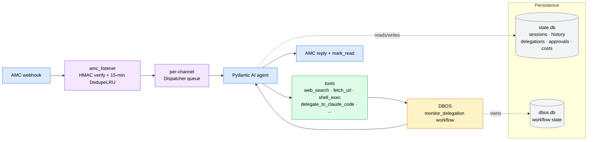

# Capo

**The Boss of your Agents.**

Capo is a personal AI orchestrator that lives in a single long-lived Python 3.12 process. It ingests chat messages (iMessage / Discord) through the AMC platform, answers trivial requests itself, and delegates real coding work to **Claude Code** / **Codex** subprocesses supervised by [DBOS](https://www.dbos.dev/) durable workflows — so spawned work survives a Capo restart.

## What it does

- **One conversation surface, many channels.** AMC delivers signed webhooks; Capo replies through the same path. You talk to one assistant; it reaches every channel.
- **Delegation is a tool call.** The Pydantic AI agent can spawn Claude Code (and, when registered, Codex) with full telemetry and approval gates — coding work is just another tool the model can invoke.
- **Restart resilience.** DBOS owns `dbos.db`; a 90-minute coding run started before a reboot resumes after the reboot.
- **Predictable cost.** Per-turn cost accounting with daily soft and hard caps, plus a `/override` per-thread sentinel to bypass a cap when you mean it.

## How a message flows

A single inbound message travels through HMAC verification, a per-channel queue, the agent loop, and — when real work is needed — a durable delegation workflow, before the reply returns over the same AMC path.

Two SQLite files back the system: `state.db` holds the application domain (sessions, conversation history, delegations, approvals, costs), while `dbos.db` holds DBOS workflow state. [Litestream](https://litestream.io/) replicates both, `launchd` supervises the process, `caffeinate` keeps macOS awake while delegations run, and [Logfire](https://logfire.pydantic.dev/) owns observability.

!!! note "The two-database split is an invariant"
    `state.db` is Alembic-managed and owns the app domain; `dbos.db` is DBOS-managed and owns workflow rows. Cross-database references (such as `approvals.workflow_id`) carry no foreign key, and the two files must be restored together. See [Architecture](architecture.md) for the full rationale.

## Tech stack

| Layer | Pin |
|---|---|
| Runtime | Python 3.12+ |
| Agent SDK | `pydantic-ai` 1.93 |
| Durable workflows | `dbos` 2.21 |
| Web | `fastapi` 0.136 + `uvicorn` 0.46 |
| Settings | `pydantic-settings` 2.14 |
| HTTP | `httpx` 0.28 |
| ORM / migrations | `sqlalchemy` 2.0 + `alembic` 1.18 |
| Observability | `logfire` 4.32 |
| Tests | `pytest` 9.0 + `pytest-asyncio` 1.3 |
| Lint | `ruff` 0.15 |

## Documentation

| Page | What you'll find |
|---|---|
| [Getting Started](getting-started.md) | Install dependencies, configure, and run Capo for the first time. |
| [Architecture](architecture.md) | The request pipeline, the two-database design, and the architectural invariants. |
| [Configuration](configuration.md) | Full `config.toml` and `.env` reference for every setting. |
| [Tools & Delegation](tools-and-delegation.md) | The tool surface, the delegation lifecycle, and the slash-command intercepts. |
| [Operations](operations.md) | `launchd` supervision, Litestream replication, observability, and the runbook. |

## Status

!!! info "Project status"
    Functionally complete through **Phase 5** (as of 2026-05-11). Capo is a personal project; the repository lives at [github.com/sequenzia/capo](https://github.com/sequenzia/capo) under the MIT license.
