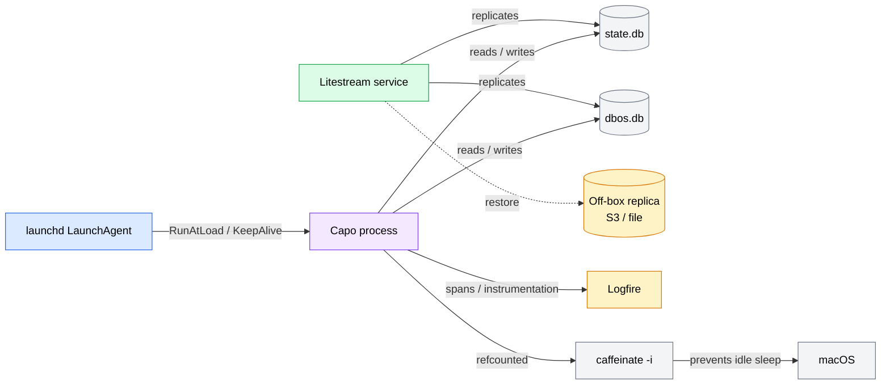

# Operations

Capo runs as a **single long-lived Python 3.12 process** on macOS. There is no container, no orchestrator, and no multi-node coordination — operational reliability comes from three independent layers around that one process:

- **launchd** supervises it: starts it at login, restarts it on crash, and keeps it pinned (no idle throttling) while delegations run.
- **Litestream** continuously replicates both SQLite databases off-box so any crash, disk failure, or bad migration is recoverable to within ~1 second.
- **Logfire** instruments every HTTP request, outbound client call, and agent run, with a fail-open design that never blocks a user reply.

This page is the canonical operational runbook. For the *why* behind the moving parts, see [Architecture](architecture.md); for every tunable referenced here, see [Configuration](configuration.md).



---

## Process supervision (launchd)

Capo is supervised by a **per-user LaunchAgent** in the `gui/<uid>` domain — *not* a system-wide daemon. The template ships at `internal/ops/com.you.capo.plist`. Rename it to `com.<username>.capo.plist` and place it in `~/Library/LaunchAgents/`. See `internal/ops/launchd.md` for the full walkthrough.

### Plist settings

| Key | Value | Notes |
|---|---|---|
| `Label` | `com.<user>.capo` | Must match the filename and the `launchctl` target. |
| `ProgramArguments` | `uv run capo …` | Apple Silicon: `/opt/homebrew/bin/uv`; Intel: `/usr/local/bin/uv`. Use the absolute path. |
| `EnvironmentVariables → PATH` | explicit | launchd does **not** inherit your shell `PATH`. Must be set or `uv`/`claude`/`codex` won't resolve. |
| `EnvironmentVariables → HOME` | explicit | Required by Claude Code / Codex; without it they can't locate their config. |
| `EnvironmentVariables → CAPO_CONFIG` | `<capo_dir>/config.toml` | Points the process at its TOML config. |
| `WorkingDirectory` | `<capo_dir>` | So `alembic.ini` and relative paths resolve. |
| `KeepAlive → SuccessfulExit` | `false` | Restart on **crash**, never on clean exit. Prevents launchd from looping on `capo --version`. |
| `RunAtLoad` | `true` | Start automatically when the agent is bootstrapped (at login). |
| `ThrottleInterval` | `10` | Minimum 10s between restarts — caps a crash-loop's blast radius. |
| `StandardOutPath` | `~/Library/Logs/capo/stdout.log` | Primary log destination. |
| `StandardErrorPath` | `~/Library/Logs/capo/stderr.log` | Boot errors and tracebacks land here. |
| `ProcessType` | `Interactive` | Disables App Nap so long delegations aren't throttled by macOS. |

!!! note "Crash recovery is automatic"
    A crash triggers `launchd` to relaunch Capo, whose **cold-boot resume sweep** re-attaches to any DBOS delegations that were still running, re-tracks them for `caffeinate`, and schedules their resume. You generally do not need to do anything manually after a crash — see [Architecture](architecture.md) for the resume-sweep mechanics.

### launchctl commands

```bash
# Bootstrap (install + start) the agent
launchctl bootstrap gui/$(id -u) ~/Library/LaunchAgents/com.<user>.capo.plist

# Graceful restart (kill + relaunch the running service)
launchctl kickstart -k gui/$(id -u)/com.<user>.capo

# Hard reload AFTER editing the plist (bootout, then bootstrap again)
launchctl bootout gui/$(id -u)/com.<user>.capo
launchctl bootstrap gui/$(id -u) ~/Library/LaunchAgents/com.<user>.capo.plist

# Status — PID "-" means the service is loaded but not running
launchctl list | grep com.<user>.capo
launchctl print gui/$(id -u)/com.<user>.capo | head -40

# Uninstall
launchctl bootout gui/$(id -u)/com.<user>.capo
rm ~/Library/LaunchAgents/com.<user>.capo.plist

# Inject a secret at runtime (LOGFIRE_TOKEN is NOT inlined in the plist)
launchctl setenv LOGFIRE_TOKEN "lf_..."
```

!!! warning "Editing the plist requires a hard reload"
    `kickstart -k` only restarts the *process*; it does not re-read the plist. After any plist change you must `bootout` and `bootstrap` again, or your edits won't take effect.

### Logs

```bash
tail -f ~/Library/Logs/capo/stdout.log    # structured app log
tail -f ~/Library/Logs/capo/stderr.log    # boot errors, tracebacks, exit-2 messages
```

---

## Replication & restore (Litestream)

**Both** `state.db` and `dbos.db` are replicated as independent pipes. Config lives at `internal/ops/litestream.yml`; the install guide is `internal/ops/litestream-install.md`.

### What's replicated

- **Two databases, two replicas.** `state.db` → `${CAPO_LITESTREAM_STATE_URL}`, `dbos.db` → `${CAPO_LITESTREAM_DBOS_URL}`. They are independent — which is exactly why the restore drill below matters.
- **Sync interval ~1s** → roughly a **1-second RPO** (recovery point objective).
- **Compaction tiers** L1 every 30s, L2 every 5m, L3 every 1h.
- **Snapshots** every 24h with **7-day (168h) retention** — an operator can restore to any point in the last week.
- **Prometheus metrics** on `127.0.0.1:9091` (loopback only).

!!! warning "Export the replica URLs before starting Litestream"
    Replica destinations come from `CAPO_LITESTREAM_STATE_URL` and `CAPO_LITESTREAM_DBOS_URL` (defaults: `file://${CAPO_HOME}/replicas/...`; production typically `s3://bucket/state.db` and `s3://bucket/dbos.db`). If these aren't exported before Litestream starts, the `${…}` paths **expand literally** and replication silently breaks — you'll have a running Litestream that's writing nowhere useful.

### Install

```bash
# Install Litestream
brew install benbjohnson/litestream/litestream

# Symlink the repo config to the brew-services location
sudo ln -sf "$(pwd)/internal/ops/litestream.yml" /opt/homebrew/etc/litestream.yml

# Start it — MUST be running before Capo opens the databases
brew services start litestream
```

!!! warning "Start order matters: Litestream before Capo"
    Litestream must hold the databases first. If Capo opens them first, Litestream logs `failed to open database: locked` and replication never starts. After any restart of either component, confirm Litestream is up before Capo.

### Paired restore drill

!!! danger "Always restore both databases from the same timestamp"
    DBOS step idempotency keys in `dbos.db` reference delegation rows in `state.db`. The cross-references (`approvals.workflow_id` → `dbos.db`, `delegations.id` → `state.db`) carry **no database foreign key** — integrity is enforced at the application layer only.

    Restoring **only one file**, or restoring the two files to **mismatched timestamps**, leaves orphaned workflows, missing approvals, and DBOS workflows replaying against rows that no longer exist. Always restore **both** databases to the **same** timestamp `T`. See `internal/ops/RUNBOOK.md` §9.4.

```bash
# (1) Stop both services
launchctl bootout gui/$(id -u)/com.<user>.capo
brew services stop litestream

# (2) Move the existing DBs + their -wal/-shm sidecars aside (do NOT delete)
for f in state dbos; do
  for ext in "" "-wal" "-shm"; do
    [ -e ~/.capo/$f.db$ext ] && mv ~/.capo/$f.db$ext ~/.capo/$f.db$ext.bak
  done
done

# (3) Restore BOTH databases to the SAME timestamp T
T="2026-06-07T03:00:00Z"
litestream restore -config internal/ops/litestream.yml -o ~/.capo/state.db -timestamp "$T" ~/.capo/state.db
litestream restore -config internal/ops/litestream.yml -o ~/.capo/dbos.db  -timestamp "$T" ~/.capo/dbos.db

# (4) Integrity-check both (expect "ok" for each)
sqlite3 ~/.capo/state.db "PRAGMA integrity_check;"
sqlite3 ~/.capo/dbos.db  "PRAGMA integrity_check;"

# (5) Start Litestream FIRST; wait for "initialized replica" on BOTH, then start Capo
brew services start litestream
# ...watch the Litestream log until both replicas report "initialized replica"...
launchctl bootstrap gui/$(id -u) ~/Library/LaunchAgents/com.<user>.capo.plist
```

---

## Database migrations

Capo uses two databases with **completely different** migration ownership.

### state.db — Alembic-managed

`state.db` is managed by Alembic. `alembic.ini` is repo-root-relative (`script_location = migrations`), so run migrations **from the repo root**:

```bash
uv run alembic upgrade head
```

Migration sequence:

```text
001_init → 002_approvals → 003_approvals_request_types → 004_costs
```

This is **idempotent** — running it when no new migrations exist is a safe no-op. It is part of the standard update sequence.

### Standard update sequence

```bash
git pull
uv sync
uv run alembic upgrade head
launchctl kickstart -k gui/$(id -u)/com.<user>.capo
```

### dbos.db — DBOS-managed

`dbos.db` applies its own schema automatically on launch. You never touch it with migration tooling.

!!! warning "Never run Alembic against dbos.db"
    Alembic owns `state.db` only. DBOS owns and auto-migrates `dbos.db` at startup. Pointing Alembic at `dbos.db` will corrupt the DBOS schema and break durable-workflow replay.

---

## Retention

Nightly maintenance prunes stale delegation output to keep `state.db` lean. Implemented in `capo/maintenance/retention.py`.

### What it prunes

- Deletes `delegation_output` rows older than `retention.delegation_output_days` (**default 14**) whose **parent delegation is terminal** (`completed` / `failed` / `killed`).
- Rows belonging to `running` or `pending` delegations are **never pruned**, regardless of age.

### How it runs

- Fires nightly at `retention.run_hour_local` (**default 3 AM local**) on a worker thread.
- Optional `VACUUM` after the prune when `retention.vacuum_after_prune` is `true` (**default false**). A `VACUUM` failure is logged and is **non-fatal**.
- A **~23h skip-recent guard** protects against clock jump-backs and rapid restarts triggering duplicate runs.
- Single-failure-tolerant: a failed run logs and the scheduler continues to the next night.

See [Configuration](configuration.md) for the `[retention]` settings.

### Verify

```bash
grep "capo.maintenance.retention" ~/Library/Logs/capo/stdout.log | tail -5
```

Events you'll see: `started`, `completed` (with `pruned_count`, `duration_ms`), `failed`, `skipped`, `cancelled`.

---

## Observability (Logfire)

Logfire instrumentation is applied at boot by `configure_logfire()` in `capo/observability.py`.

### Instrumented surfaces

- **FastAPI** — every HTTP request, including `/healthz`.
- **httpx** — all clients, including AMC outbound sends.
- **Pydantic AI** — every `Agent` run.

### Span taxonomy

!!! note "Spans are AST-enforced"
    Per spec §6.5, every span in `capo/` must be created through a **named constructor** in `capo/observability.py`. A raw `logfire.span(` call anywhere else fails `tests/test_span_taxonomy.py`. This guarantees a stable, queryable span vocabulary.

| Span | Key attributes |
|---|---|
| `capo.boot` | — |
| `capo.amc.webhook.in` | `delivery_id`, `signature_ok`, `dedupe_hit` |
| `capo.dispatcher.handle` | — |
| `capo.agent.run` | `model`, `tokens_in`, `tokens_out`, `cost_usd` |
| `capo.tool.<name>` | — |
| `capo.delegation.<agent>.spawn` / `.monitor` / `.complete` | — |
| `capo.amc.send` | `idempotency_key`, `error_code` |
| `capo.memory.compact` | — (see caveat — these never appear today) |
| `capo.budget.cap` | `cap_kind` |
| `capo.approval.request` / `.resolve` | — |

### Recommended alerts

Alerts are declared in `internal/ops/logfire-alerts.yml` and applied **manually** via the Logfire MCP. Capo does **not** auto-create them (see `internal/ops/logfire-alerts.md`).

| Alert | Severity | Window | Condition |
|---|---|---|---|
| `capo_delegation_failures_hourly` | high | 1h | `delegation.complete` with `status=failed` |
| `capo_amc_send_errors_15m` | high | 15m | `amc.send` `error_code` in `PLATFORM_AUTH` / `INTERNAL_ERROR` |
| `capo_dbos_workflow_exceptions_15m` | high | 15m | `monitor`/`approval` workflow `is_exception` |
| `capo_budget_hard_cap_reached` | critical | 15m | `budget.cap` with `cap_kind=hard` |
| `capo_healthz_failures_5m` | critical | 5m | `/healthz` returning 5xx |
| `capo_webhook_signature_failures_5m` | high | 5m | `webhook` `signature_ok=false`, count > 5 |
| `capo_webhook_p99_latency_5m` | medium | 5m | `webhook` P99 latency > 2s |

### Fail-open behavior

!!! note "Observability never blocks a user reply"
    Logfire is fail-open by design (an architectural invariant):

    - `configure_logfire()` catches **all** exceptions, returns `None`, and the app continues.
    - Span call sites fall back to `nullcontext` when Logfire is unconfigured.
    - Each auto-instrument call (FastAPI / httpx / Pydantic AI) is independently guarded.

    The **only** hard failure is `LogfireMissingError` — the `logfire` package itself not being importable — which prints a single-line message to stderr and exits `2`. If `LOGFIRE_TOKEN` is unset and `LOGFIRE_IGNORE_NO_CONFIG=1`, Logfire skips silently (dev mode).

---

## Health checks

Capo exposes `GET /healthz` on `127.0.0.1:<amc.listen_port>` (**default 8090**). The endpoint is registered on the AMC listener's FastAPI app; implementation in `capo/transport/health.py`.

!!! warning "Port 8090, not 8000"
    Some older ops notes reference port 8000. That is **stale** — the code binds `amc.listen_port` (default **8090**).

Probes run **concurrently**, each with a 2s timeout and a 5s overall budget.

**Critical probes** (failure → HTTP 503):

- `state_db` — read-only `SELECT 1` against `state.db`.
- `dbos_db` — read probe; a **missing file is OK** (DBOS creates it on first launch).
- `dbos_launched` — asserts DBOS has started.

**Non-critical probes** (failure → still HTTP 200, with `ok=false` for that probe):

- `amc_reachable` — HEAD request to `amc.base_url`.
- `logfire_configured` — is Logfire configured?
- `claude_binary` — `claude --version` exits 0.
- `codex_binary` — `codex --version` exits 0.

The endpoint **never raises**: any internal error becomes a `503` with an empty `probes` array.

!!! note "Older `subsystems` / `uptime_seconds` shape is outdated"
    An earlier RUNBOOK example showed a body with `subsystems` and `uptime_seconds`. That shape is no longer accurate — the authoritative response is the `probes` array shown below.

```bash
curl -s http://127.0.0.1:8090/healthz | jq .
```

```json
{
  "status": "ok",
  "probes": [
    { "name": "state_db",          "ok": true,  "latency_ms": 1,  "details": null },
    { "name": "dbos_db",           "ok": true,  "latency_ms": 1,  "details": null },
    { "name": "dbos_launched",     "ok": true,  "latency_ms": 0,  "details": null },
    { "name": "amc_reachable",     "ok": true,  "latency_ms": 42, "details": null },
    { "name": "logfire_configured","ok": true,  "latency_ms": 0,  "details": null },
    { "name": "claude_binary",     "ok": true,  "latency_ms": 88, "details": null },
    { "name": "codex_binary",      "ok": false, "latency_ms": 12, "details": "binary not found" }
  ]
}
```

`status` is `"ok"` (HTTP 200) iff every **critical** probe passed; otherwise `"degraded"` (HTTP 503). In the example above the non-critical `codex_binary` probe failed, so the overall status is still `"ok"`.

---

## Keeping macOS awake (caffeinate)

Long Claude Code / Codex runs must not be throttled by macOS idle sleep. `capo/caffeinate.py` runs `caffeinate -i` (prevents idle sleep) **while any delegation is active**.

- **Refcounted.** A single `caffeinate -i` instance is spawned on the **first** tracked delegation and reaped when the **last** one releases. Reaping sends `SIGTERM`, then `SIGKILL` after a 5s defensive ceiling.
- **Cold-boot aware.** After a crash + restart, the resume sweep re-tracks every still-running delegation *before* scheduling resume, so `caffeinate` re-engages correctly.
- **Non-macOS:** no-ops.
- **Binary missing on macOS:** logged at WARNING and latched off — the active-delegation set is still tracked, but idle sleep is no longer prevented.

---

## Known limitations & caveats

This is the canonical list of operationally relevant caveats. Each has a real operator-facing consequence.

!!! warning "1. Paired Litestream restore is mandatory"
    You must restore **both** `state.db` and `dbos.db` from the **same** timestamp. Restoring one alone, or to mismatched timestamps, leaves orphaned workflows and missing approvals — DBOS replays against non-existent rows. See [Paired restore drill](#paired-restore-drill).

!!! warning "2. Queue-full means silent message loss"
    `amc_listener` records `delivery_id` in the 15-minute dedupe LRU **before** enqueue. When a per-channel queue is full (cap **100**), the envelope is dropped — and AMC's retries dedupe away within the 15-minute TTL, so the message is gone for good. **There is no alert for this today**; watch queue depth manually under load.

!!! warning "3. 30-second session-id capture window"
    `claude_code.py SESSION_ID_CAPTURE_TIMEOUT_S = 30.0`. A slow Claude Code cold start can exceed 30s and fail-fast an otherwise healthy session. **Mitigation:** re-send the task to retry.

!!! warning "4. Hardcoded pricing table under-reports cost"
    `capo/costs.py PRICING_TABLE` is pinned to the Claude 4 family (as of 2026-05-11). Model ids not in the table **silently cost $0**, so cost accounting under-reports for newer models until the table is updated.

!!! warning "5. Compaction is silently disabled"
    `capo/main.py` never passes a `compaction_summarizer` to the `Dispatcher`, so **even with `[compaction] enabled = true`** in TOML, no compaction runs and `capo.memory.compact` spans never appear. Don't rely on compaction in production today.

!!! warning "6. delegate_to_codex is not registered"
    `delegate_to_codex` is defined in `capo/tools/codex.py` but is **not** registered onto the agent. The LLM cannot start a Codex delegation in production. See [Tools & Delegation](tools-and-delegation.md).

!!! warning "7. heartbeat_intervals_json is vestigial"
    The `heartbeat_intervals_json` column was created by migration `001` and has **zero** source references. It will be dropped — do not build on it.

---

**Related pages:** [Architecture](architecture.md) · [Configuration](configuration.md) · `internal/ops/RUNBOOK.md`
