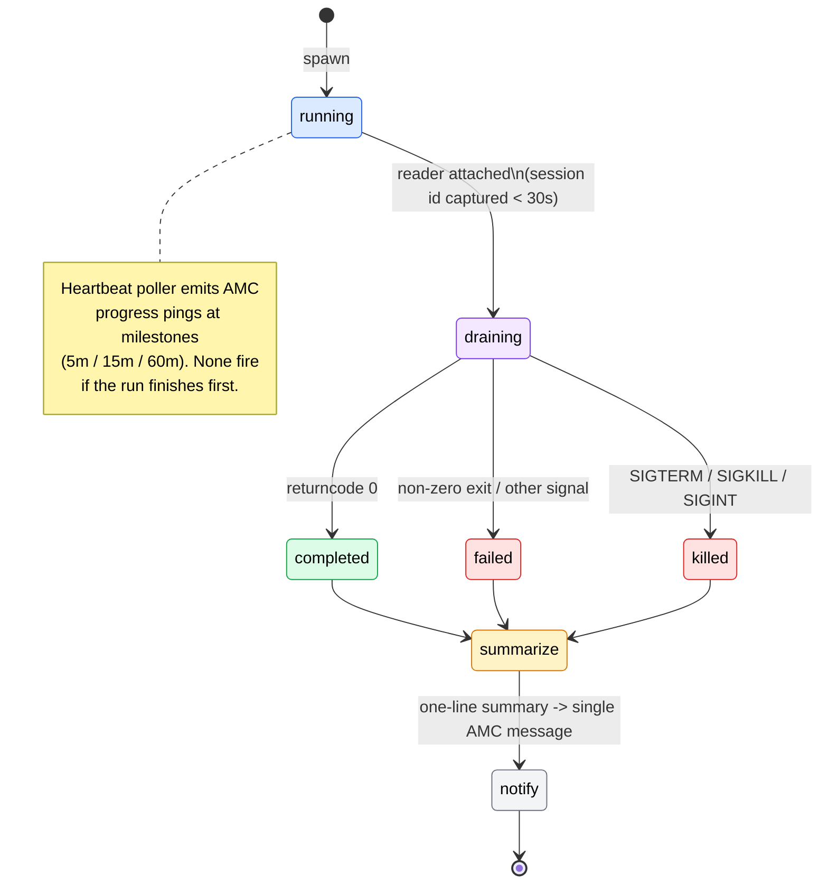

# Tools & Delegation

Capo is a [Pydantic AI](https://ai.pydantic.dev/) agent that does as little as possible itself. Trivial requests — a quick web lookup, a status check, a question it can answer directly — are handled inside the orchestrator loop. Anything that looks like *real coding work* is **delegated** to a Claude Code subprocess that runs as a subagent, supervised by a [DBOS](architecture.md) durable workflow.

Tools are the agent's hands. Every LLM-callable capability — searching the web, running an allowlisted shell command, spawning a subagent, checking on a running delegation — is registered as a tool the model can call. This page documents the full tool registry, the dependencies every tool receives, the delegation lifecycle, the approval and budget gates that wrap risky actions, and the slash commands that bypass the LLM entirely.

## Tool reference

Tools are registered onto the agent in `capo/agent.py` (`build_agent`) through three helpers, in order: `register_basic_tools` (always), `register_phase2_tools`, and `register_phase5_tools`. The tool's docstring *is* the model-visible description, so the model only learns *when* to reach for a tool from what those docstrings say.

| Tool | Category | Purpose |
|---|---|---|
| `web_search` | Basic (`capo/tools/basic.py`) | Search the public web; returns `list[SearchResult]`. Raises `ModelRetry` on an empty query or when no provider is configured. |
| `fetch_url` | Basic (`capo/tools/basic.py`) | Fetch an HTTP/HTTPS URL body as text (1 MiB cap, 15 s timeout). Returns the body or a structured `FetchError`. |
| `shell_exec` | Phase 2 (`capo/tools/basic.py`) | Allowlist-enforced subprocess runner. Allowlisted binaries run directly; non-allowlisted invocations route through the approval workflow. |
| `delegate_to_claude_code` | Phase 2 (`capo/tools/claude_code.py`) | Spawn a Claude Code subprocess as a subagent, hand off to the DBOS `monitor_delegation` workflow, and return a handle immediately. |
| `check_delegation_status` | Phase 2 (`capo/tools/delegations.py`) | Side-effect-free status snapshot for a `delegation_id` (status, `started_at`, `runtime_seconds`, `last_activity_ts`, `summary_one_line`). |
| `get_delegation_output` | Phase 2 (`capo/tools/delegations.py`) | Tail recent output chunks (`stdout` / `event`). `tail_lines` is clamped to 1–1000; an unknown id returns `[]` (a polling race, not an error). |
| `kill_delegation` | Phase 2 (`capo/tools/delegations.py`) | Kill a running delegation. Owner kills go direct (`SIGTERM` → `SIGKILL` after 5 s); non-owner kills route through approval and cascade-cancel tied pending approvals. |
| `list_delegations` | Phase 2 (`capo/tools/delegations.py`) | List recent delegations for the current user (optional status filter, default limit 20). |
| `session_new` | Phase 5 (`capo/tools/session.py`) | Natural-language counterpart of `/new`: end the active session; history is preserved on disk. |
| `session_status` | Phase 5 (`capo/tools/session.py`) | Natural-language counterpart of `/status`: model, active delegation count, today's USD cost, message count, `thread_id`. |
| `session_clear` | Phase 5 (`capo/tools/session.py`) | Natural-language counterpart of `/clear`: delete `conversation_history` for the thread and end the session. |

!!! warning "Codex delegation is not reachable in production"
    `delegate_to_codex` is fully implemented and exported in `capo/tools/codex.py`, but `register_phase2_tools` in `capo/tools/__init__.py` registers `delegate_to_claude_code` **only** — `codex.py` is never imported by the registration path. The LLM therefore cannot start a Codex delegation through tool-calling. Existing Codex delegation rows can still be resumed by the workflow layer, but no **new** Codex delegation can be initiated.

### `shell_exec` allowlist and approval routing

`shell_exec` splits every invocation into one of three outcomes:

- **Allowlisted binary** → runs directly as a subprocess.
- **Non-allowlisted but otherwise valid** → routed through the [approval workflow](#approvals); the command runs only after a human approves it.
- **Hard-rejected (non-approvable)** → refused outright with no approval offered.

A command is hard-rejected when it contains shell metacharacters (`;`, `&&`, `||`, `|`, `` ` ``, `$(`, `>`, `<`), invokes `sudo`, fails tokenization, or targets a `cwd` outside `projects_root` / `workspaces_root`. These cannot be approved — the answer is no.

## CapoDeps

Every tool receives the same injected context as its first parameter: `RunContext[CapoDeps]`. `CapoDeps` (`capo/deps.py`) is a plain `@dataclass` — deliberately **not** Pydantic and **not** frozen — so the dispatcher can mutate per-turn fields cheaply before each `agent.run`.

| Field | Purpose |
|---|---|
| `settings` | The singleton validated config. Tools read allowlists, caps, model ids, and paths from here. |
| `http_client` | A shared `httpx.AsyncClient` (one connection pool reused across network tools). |
| `web_search_client` | Optional `WebSearchClient`. When `None`, `web_search` returns a `ModelRetry` ("no provider configured") rather than crashing. |
| `user_id` | The resolved internal user id for the current turn. Mutated per-turn by the dispatcher. |
| `thread_id` | The thread id, shaped `"amc:<channel_id>"`. Persisted on delegation rows as `parent_thread_id` so completion notifications route back to the originating channel. |
| `workspaces_root` | Mirror of `settings.paths.workspaces_root`; where delegation workspaces live. |
| `projects_root` | Mirror of `settings.paths.projects_root`; the scope boundary for in-root repos. |

!!! note "Why it isn't frozen"
    `user_id` and `thread_id` change on every inbound envelope. The dispatcher mutates them in place on the single `CapoDeps` instance before each `agent.run` rather than reconstructing the dataclass per turn. See [Architecture](architecture.md) for how the dispatcher owns this object.

## Delegating to Claude Code

The argument to `delegate_to_claude_code` is a single frozen Pydantic model, `ClaudeCodeBrief` (`extra="forbid"`, whitespace-stripped). Unknown fields are rejected outright.

| Field | Type | Default | Description |
|---|---|---|---|
| `goal` | `str` (`min_length=1`) | *required* | Imperative description of the task. |
| `repo_path` | `str` (`min_length=1`) | *required* | Absolute path to the target repository. |
| `constraints` | `list[str]` | `[]` | "Don't do X / must use Y" rules. |
| `success_criteria` | `list[str]` | `[]` | Verifiable completion conditions. |
| `relevant_files` | `list[str]` | `[]` | Files the subagent should read first. |
| `create_worktree` | `bool` | `True` | Whether to `git worktree add` an isolated branch for the run. |
| `model` | `str \| None` | `None` | Per-delegation model override. `None` falls back to `config.models.subagents.claude_code`. |

### Spawn flow

When the model calls `delegate_to_claude_code`, the tool (`capo/tools/claude_code.py`) does the following before it returns:

1. **Generate `delegation_id`** — a `uuid4` hex string that names the run end-to-end.
2. **Scope-check `repo_path`** against `projects_root`. An out-of-scope path triggers the [approval workflow](#approvals); a denied or expired approval rejects the delegation.
3. **Create the workspace** directory under `workspaces_root/<delegation_id>/`.
4. **Optionally `git worktree add`** an isolated branch off `worktree_base_branch` (default `main`) when `create_worktree` is `True`.
5. **Render the prompt** deterministically from `prompts/delegation_brief.md` (no timestamps, no env reads — same brief produces byte-identical output).
6. **Build the argv**: `claude -p <prompt> --output-format stream-json --verbose --permission-mode <mode>`, plus `--model` when a model override is set.
7. **Spawn the subprocess.**
8. **`INSERT` a `delegations` row** with `status='running'`, `pid`, `parent_thread_id`, `session_id_subagent=NULL`, `brief_json`, `model`, and `started_at`.
9. **Register `caffeinate`** to keep macOS awake for the duration of the run.
10. **Start the output reader**, draining `stdout` / `stderr` into `delegation_output`.
11. **Hand off to DBOS** — a background task awaits the subagent's session id within a 30-second window, then invokes `monitor_delegation`.

The tool then **returns a `DelegationHandle` immediately** — `delegation_id`, `agent="claude-code"`, `workspace`, `status="running"` — without waiting for the run to complete. The model gets a handle it can poll with `check_delegation_status` and `get_delegation_output`. The `claude` binary is version-pinned (minimum `2.1.138`), enforced at boot.

!!! warning "30-second session-id window"
    `SESSION_ID_CAPTURE_TIMEOUT_S = 30.0`. If the first JSON event carrying `session_id` does not arrive within 30 seconds — which slow cold starts can cause — Capo kills the subprocess and marks the row `failed`, even if Claude Code was otherwise healthy. Re-send the task to retry.

## Delegation lifecycle

Once the subagent is spawned, the DBOS workflow `monitor_delegation` (`capo/workflows/delegation.py`, Capo's largest module at ~3268 lines) owns the run from `running` to a terminal state. Because it is a durable workflow, it survives a Capo restart and resumes where it left off.

### States explained

The `delegations.status` column moves through these states:

- **`running`** — set at spawn. The subprocess is live and the DBOS workflow is monitoring it. Within 30 seconds, `session_id_subagent` is populated from the first JSON event. (Session-id capture is a sub-milestone, not a separate status.)
- **output draining** — a DBOS-checkpointed step drains `stdout` / `event` chunks into `delegation_output` until EOF.
- **terminal transition** — on subprocess exit, the status resolves:

    | Exit condition | Terminal status |
    |---|---|
    | `returncode == 0` | `completed` |
    | `SIGTERM` / `SIGKILL` / `SIGINT` | `killed` |
    | Other signal, or non-zero exit | `failed` (records the signal name, or `"exit code N: <stderr tail>"`) |

- **summarize → notify** — a deterministic one-line summary is written to `delegations.summary`, then **one** AMC completion message is sent to the originating channel. Both steps are at-most-once (idempotent), and neither involves the LLM or the SOUL prompt.

### Heartbeats

While a delegation runs, a concurrent poller emits AMC progress pings at milestone thresholds (defaults 5 m / 15 m / 60 m), so a long-running task still produces signs of life. If the run finishes before the first threshold, no heartbeat fires.

### Restart-resume

If the workflow re-enters after a Capo restart, it re-spawns `claude --resume <session_id_subagent>` in the original workspace rather than starting over. On **every** terminal transition, the `caffeinate` hold is released. See [Architecture](architecture.md) for how the cold-boot sweep re-invokes `monitor_delegation` for every `status='running'` row, and [Operations](operations.md) for restart and recovery procedures.

## Approvals

Risky actions — an out-of-scope delegation `repo_path`, a non-allowlisted `shell_exec`, a non-owner `kill_delegation` — do not fail and do not silently proceed. They pause and ask a human, via the `request_approval` DBOS workflow (`capo/workflows/approval.py`).

**Flow:**

1. **`INSERT` a pending `approvals` row** (idempotent, keyed by `approval_id`) storing `request_type`, `request_payload` JSON, `requester_user_id`, `parent_thread_id`, and `workflow_id` (the DBOS workflow id).
2. **Notify via AMC**: `Approval required (<type>): <id> ... Reply with /approve <id> or /deny <id>.`
3. **`DBOS.recv`** waits on the `approval_decision` topic. The default timeout is 24 h, but callers can pass a shorter `timeout_seconds` — `shell_exec`, for example, uses `approval.timeout_seconds` (e.g. `1800`).

**States:** `pending → approved | denied | expired | cancelled`.

**Resolution.** The dispatcher intercepts `/approve` and `/deny` **before** the agent runs. It looks up the row in `state.db`, reads its `workflow_id`, and calls `DBOS.send(workflow_id, {status, resolved_by, reason}, "approval_decision")` to unblock the waiting workflow. If the approval is already resolved, the dispatcher replies `That approval is already resolved.` and does not re-send (idempotent).

!!! note "Any thread member can resolve"
    V1 does **not** enforce that the resolver is the original requester. Any user in the same thread may approve or deny a pending request.

!!! info "The cross-DB `workflow_id` bridge"
    Capo keeps two SQLite databases: `state.db` (app domain) and `dbos.db` (workflow rows). The `approvals` row lives in `state.db` but stores the DBOS `workflow_id` so the dispatcher can find and signal the workflow in `dbos.db`. This reference carries **no foreign key** — it is a deliberate cross-DB bridge. See [Architecture](architecture.md#the-two-database-model) and the [Operations](operations.md) runbook, which warns against restoring only one database from backup.

## Budget & `/override`

Before every `agent.run`, `check_budget` (`capo/budget.py`) returns a status: `ok`, `soft_warn`, `hard_block`, or `overridden`.

On `hard_block`, the dispatcher refuses the turn:

> Daily cost cap reached: \$X of \$Y. Reply with /override to bypass the cap for the next turn.

`/override` arms a **per-thread one-shot sentinel**. The sentinel is consumed **only** when a hard block would actually fire — not on `ok` or `soft_warn` turns — so an override armed in advance survives until a real hard block occurs and is spent there.

!!! tip "Fail-open accounting"
    Cost accounting is fail-open: any accountant error yields status `ok` and never blocks the user's reply. Spending control is a guardrail, not a single point of failure. See [Configuration](configuration.md) for the daily-cap settings.

## Slash commands

Slash commands are parsed off the raw inbound text **before** `agent.run`, by `parse_slash_command` in `capo/transport/dispatcher.py`. The recognized verbs are `approve`, `deny`, `new`, `status`, `clear`, `kill`, and `override`.

!!! note "Slash commands cost zero LLM tokens"
    Every recognized slash command is intercepted pre-agent and handled without ever calling the model. This is an architectural invariant of Capo — these commands are fast, deterministic, and free, and they never enter the agent loop.

| Command | Args | Effect |
|---|---|---|
| `/approve` | `[<id>] [<reason>]` | Resolve a pending approval (by id, else the most-recent one in the thread) as **approved**. |
| `/deny` | `[<id>] [<reason>]` | Same lookup, resolved as **denied**. |
| `/new` | — | End the active session row; the next turn starts fresh. History is preserved on disk. Replies `Started new session`. |
| `/status` | — | Reply with the model, active delegation count, conversation message count, and today's UTC cost. |
| `/clear` | — | Delete all `conversation_history` for `(user_id, thread_id)` and end the active session. Replies `Conversation cleared`. |
| `/kill` | `<delegation_id>` | Kill a delegation (owner direct; non-owner via approval); cascade-cancels tied approvals. Missing id → usage hint; unknown id → `unknown delegation`. |
| `/override` | — | Arm the one-shot cost-cap bypass for the next hard-blocked turn. Replies `Cost cap override armed for the next agent turn`. |

An unrecognized verb is rejected with:

> Unknown command: /\<verb\>. Supported: /new /status /clear /kill /override /approve /deny

---

**Related pages:** [Configuration](configuration.md) · [Architecture](architecture.md) · [Operations](operations.md)
