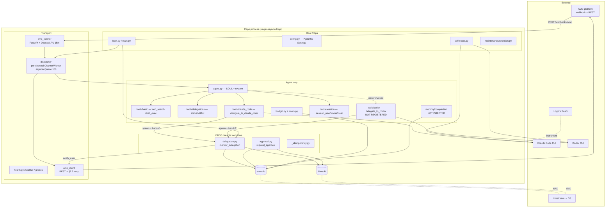

# Capo Codebase Analysis Report

**Date**: 2026-05-11
**Scope**: `/Users/ada/dev/repos/capo` — 38 source files / 22,744 LOC + 57 test files / ~34k LOC + ops + spec
**Method**: 4 code-explorer agents (transport, workflows, agent/tools, infra) + 1 code-synthesizer; hub-and-spoke; every High-severity finding verified by direct file read or grep

---

## Executive Summary

Capo is a **single long-lived Python 3.12 process** that ingests AMC chat messages via FastAPI webhook, fans them out to per-channel asyncio queue workers, runs a Pydantic AI agent loop, and delegates real coding work to Claude Code / Codex subprocesses supervised by DBOS durable workflows so spawned work survives a Capo restart. Two SQLite files split state cleanly: `state.db` for the app domain, `dbos.db` for DBOS workflow rows; Litestream replicates both; launchd supervises the process; caffeinate keeps macOS awake while delegations run; Logfire owns observability.

The implementation is **functionally complete through Phase 5** (per in-spec checkpoint annotations dated 2026-05-11) with a **1.5:1 test-to-code ratio** (57 test files / 34.3k LOC against 38 source files / 22.7k LOC). **Three findings dominate the risk picture:**

- **H1 (R3)** — the compaction summarizer is fully implemented but **never injected at the production `Dispatcher` construction site** (`main.py:428`), so compaction is silently disabled even when `[compaction] enabled = true`.
- **H2 (R2)** — `delegate_to_codex` is implemented, tested, and observable but **never registered onto the agent**, so the LLM cannot route to Codex via tool-calling in production.
- **H3 (R1)** — the spec's headline "Readable" success metric — **"< ~800 LOC at Phase 5 close"** (§3 line 65) — is overshot by ~28×, with `delegation.py` alone (3268 LOC) more than 4× the entire target.

A fourth High-severity finding **R4** describes a queue-full + dedupe race that can cause permanent message loss under sustained backpressure.

---

## Architecture Overview



---

## Tech Stack

| Layer | Pin | Notes |
|---|---|---|
| Runtime | Python 3.12+ | `requires-python = ">=3.12"` |
| Agent SDK | pydantic-ai 1.93.0 | `Agent`, `RunContext`, `ModelMessage`; lazy-imported |
| Durable workflows | dbos 2.21.0 | Owns `dbos.db`; `@DBOS.workflow/step`, `send/recv` |
| Web | fastapi 0.136.1 + uvicorn 0.46.0 | Programmatic uvicorn, asyncio.run-controlled |
| Settings | pydantic-settings 2.14.1 | TOML loader + `SecretStr` env bridge |
| HTTP | httpx 0.28.1 | One shared `AsyncClient` per process |
| ORM/migrations | sqlalchemy 2.0.49 + alembic 1.18.4 | Hand-written DDL via `op.execute` |
| Observability | logfire 4.32.1 | `instrument_httpx`/`pydantic_ai`/`fastapi`; fail-tolerant |
| Tests | pytest 9.0.3 + pytest-asyncio 1.3.0 | 57 files, flat `tests/` |
| Lint | ruff 0.15.12 | E/W/F/I/B/UP/SIM, line-length 100 |

Production dependency surface is intentionally tiny (10 pinned packages).

---

## Critical Files

| File | Lines | Purpose |
|---|---|---|
| `capo/workflows/delegation.py` | 3268 | DBOS `monitor_delegation` + `summarize_run` + `notify_user` + restart-resume for CC & Codex + returncode classifier + caffeinate refcount |
| `capo/transport/dispatcher.py` | 1869 | Hot path: per-channel `ChannelWorker`, §5.2 turn pipeline, slash-command surface, budget hook, `/override` sentinel, lazy compaction call site |
| `capo/tools/codex.py` | 1421 | `delegate_to_codex` — full Codex spawn argv, approval gate, DBOS handoff. **Defined and exported but not registered onto the agent.** |
| `capo/tools/claude_code.py` | 1381 | `delegate_to_claude_code` — spawn, `_await_session_id` (30s window), DBOS handoff |
| `capo/workflows/approval.py` | 1149 | `request_approval` DBOS workflow + `notify_approval`. Bridges state.db `approvals.workflow_id` to dbos.db workflow rows |
| `capo/main.py` | 758 | 15-step boot sequence (settings → Logfire → agent → Dispatcher → DBOS launch → cold-boot sweep → retention → uvicorn) |
| `capo/observability.py` | 824 | Named-span constructors enforcing §6.5 taxonomy; AST-asserted by `tests/test_span_taxonomy.py` |
| `capo/config.py` | 713 | 15-section TOML + `.env` Settings; disables env auto-resolve to avoid `[shell]` collision |
| `capo/transport/amc_client.py` | 648 | §7.5 retry policy with typed error hierarchy; idempotency-key on every send |
| `capo/workflows/_idempotency.py` | 631 | `@idempotent_step` decorator: SHA-256 keys persisted as DBOS workflow events |
| `capo/memory/compaction.py` | 604 | 3-phase compaction (snapshot → LLM summarize → atomic commit with drift detection). **Production never injects a summarizer.** |
| `capo/costs.py` | 608 | Cost accountant + hardcoded Claude 4 pricing table dated 2026-05-11 |
| `capo/caffeinate.py` | 548 | macOS-only refcount-by-set sleep prevention while delegations run |
| `capo/maintenance/retention.py` | 490 | Nightly 3am-local `delegation_output` pruning with VACUUM |
| `capo/transport/amc_listener.py` | 429 | FastAPI webhook: HMAC → DedupeLRU → fast-ACK 204 → enqueue (drops silently on queue-full) |

---

## Patterns & Conventions

- **Spec-first discipline.** Every module docstring cites `capo-SPEC.md` section numbers. Migrations preserve §7.3 SQL verbatim via `op.execute`.
- **Lazy imports for heavy/optional deps.** `pydantic_ai`, FastAPI, DBOS, and tools are imported inside functions so `--version` / `--no-serve` paths stay fast.
- **Dependency injection over module-level globals.** `Dispatcher(settings, agent, amc_client, conn_factory, http_client=...)` accepts injectable fakes for every side-effect. The few process-singleton registries (`register_amc_sender`, `register_caffeinate_manager`, `register_delegation_subprocess`) accept `None` to clear.
- **Idempotency keys everywhere.** Webhook dedupe (`X-AMC-Delivery-Id`, 15min LRU); `@idempotent_step` for AMC sends and DB writes; AMC `Idempotency-Key` HTTP header keyed by the same SHA-256.
- **Two-DB consistency by convention, not constraint.** `approvals.workflow_id` and `delegations.id` cross into dbos.db without FKs.
- **Fail-open on observability/accounting.** Logfire boot failure, cost-accountant errors, compaction errors never block the user reply.
- **CapoDeps as the canonical tool arg.** Every tool's first parameter is `RunContext[CapoDeps]`; per-turn `user_id`/`thread_id` are mutated before each `agent.run`.
- **Pre-agent text intercepts.** Slash commands (`/status`, `/kill`, `/override`, `/approve`, `/deny`, …) are parsed off raw inbound text before the LLM loop — zero LLM tokens consumed.
- **Span taxonomy enforced via AST.** `tests/test_span_taxonomy.py` scans `capo/` for raw `with_span(` calls and rejects anything outside `observability.py`.
- **Determinism inside DBOS workflows.** No `datetime.now()`, `uuid4()`, or env reads inside workflow or step bodies — all timestamps are passed in. Deterministic args drive idempotency keys.
- **Lazy workflow registration.** `@DBOS.workflow()` is applied inside `_register_workflow()` on first call, guarded by `threading.Lock`. The module stays importable before DBOS launches.

---

## Relationship Map — webhook → reply lifecycle

```mermaid
sequenceDiagram
    participant AMC
    participant Listener as amc_listener
    participant Dedupe as DedupeLRU
    participant Worker as ChannelWorker
    participant Agent
    participant Tool as delegate_to_claude_code
    participant DBOS as monitor_delegation
    participant SDB as state.db
    participant DDB as dbos.db
    participant Out as AMC client

    AMC->>Listener: POST /webhooks/amc<br/>(HMAC, X-AMC-Delivery-Id)
    Listener->>Listener: HMAC verify
    Listener->>Dedupe: seen_and_record(delivery_id)
    alt duplicate
        Dedupe-->>Listener: True → 204
    else fresh
        Listener->>Worker: enqueue(envelope)
        alt queue full
            Note over Listener,AMC: 204 returned;<br/>envelope DROPPED;<br/>dedupe row already written → R4
        else accepted
            Worker->>Worker: slash / override intercept
            Worker->>Worker: budget gate (soft/hard)
            Worker->>Agent: agent.run(text, deps)
            Agent->>Tool: delegate_to_claude_code(brief)
            Tool->>SDB: INSERT delegations(status='running')
            Tool->>Tool: spawn `claude` + _await_session_id ≤30s
            Tool->>DBOS: handoff (start workflow)
            DBOS->>DDB: workflow checkpoint
            DBOS->>DBOS: drain + heartbeat + poll loop
            DBOS->>SDB: UPDATE delegations(status, summary, cost)
            DBOS->>Out: notify_user (idempotent)
            Tool-->>Agent: handle returned
            Agent-->>Worker: reply text
            Worker->>Worker: _maybe_compact (no-op: summarizer is None → R3)
            Worker->>Out: amc.send(reply); amc.mark_read
            Worker->>SDB: append conversation_history
        end
    end
```

---

## Challenges & Risks

| # | Challenge | Severity | Impact |
|---|---|---|---|
| R1 | Spec "<800 LOC" success metric overshot ~28× | High | Inverts the "readable in an evening" design assertion; actual 22,744 LOC vs spec §3 target |
| R2 | `delegate_to_codex` defined but never registered as an agent tool | High | LLM cannot invoke Codex via tool-calling; entire 1421-LOC subsystem dark in production for agent-driven use |
| R3 | Compaction silently disabled in production | High | `main.py:428` omits `compaction_summarizer=` kwarg; memory grows unbounded per thread even when `[compaction] enabled = true` |
| R4 | Queue-full + dedupe race causes permanent message loss | High | `dedupe.seen_and_record` runs *before* `enqueue`; queue-full returns 204; AMC retries hit dedupe and never re-attempt within the 15min TTL |
| R5 | Cross-DB consistency without FK or co-recovery story | Medium | `approvals.workflow_id` and `delegations.id` cross into dbos.db; Litestream replicates both independently; paired-restore protocol undocumented |
| R6 | `heartbeat_intervals_json` is an orphan column | Medium | Created by migration 001, zero source references; either drop or wire the per-row override it was clearly designed for |
| R7 | 30s session-id capture window can fail-fast a healthy CC | Medium | Pathological cold-start latency on a busy machine can trip the timeout; recovery via cold-boot sweep needs the row alive long enough |
| R8 | Hardcoded pricing → unknown models cost $0 | Medium | Soft/hard caps understate spend if Anthropic ships a new model id before the table is updated |
| R9 | `dispatcher.py` imports `TestModel` from `pydantic_ai.models.test` in production | Low | Production-on-test-module dependency; would break if Pydantic AI moves `TestModel` behind a testing extra |
| R10 | `dispatcher.py` at 1869 LOC owns 5 distinct responsibilities | Medium | Slash surface, queue, turn pipeline, override sentinel, compaction call site all bundled; hard to test in isolation |
| R11 | No incremental git history within phases | Low | Three phase-rollup commits; `git bisect`/`git blame` granularity is phase-level only |
| R12 | Tests reproduce production schema verbatim | Low | 10 test files inline the `CREATE TABLE` DDL; schema evolution requires 10 edits |

---

## Recommendations

1. **Wire `delegate_to_codex` into `register_phase2_tools`** in `capo/tools/__init__.py`; add `tests/test_agent_tool_registration.py` introspection test that asserts the agent's toolsets contain every public tool. *(addresses: R2)*
2. **Inject the compaction summarizer in `main.amain()`.** Build a cheap-model summarizer `Agent` (per `[models.compaction]` if it exists, else default sonnet/haiku) and pass `compaction_summarizer=` into the `Dispatcher(...)` call at `main.py:428`; add a regression test asserting non-None when `[compaction] enabled = true`. *(addresses: R3)*
3. **Reverse the dedupe/enqueue ordering or return 503 on queue-full.** Record dedupe *after* successful enqueue; return 503 (not 204) when queue is full so AMC retries; add a queue-full regression test. *(addresses: R4)*
4. **Reconcile or retire the spec's "<800 LOC" success metric.** Update `internal/specs/capo-SPEC.md` §3 line 65 with a defensible ceiling reflecting reality (e.g. "< 25k LOC, < 5 files > 1500 LOC"). *(addresses: R1)*
5. **Document a paired-restore protocol for `state.db` + `dbos.db` in `internal/ops/RUNBOOK.md`.** Optionally surface as a `capo doctor` subcommand that walks `approvals.workflow_id` against dbos.db. *(addresses: R5)*
6. **Drop `heartbeat_intervals_json` in a `005_drop_orphan_columns` migration** (or wire it to a per-row override). *(addresses: R6)*
7. **Make `SESSION_ID_CAPTURE_TIMEOUT_S` config-driven and warn at 50%.** *(addresses: R7)*
8. **Externalize the pricing table** to `internal/ops/pricing.toml` loaded at boot; alert on `capo.costs.pricing.unknown_model` warnings. *(addresses: R8)*
9. **Replace `TestModel` import with a tiny inline placeholder** in `dispatcher.py`. *(addresses: R9)*
10. **Extract the slash-command surface from `dispatcher.py` into `transport/slash.py`** — target dispatcher.py from 1869 → ~1100 LOC. *(addresses: R10)*
11. **Centralize test-DB schema in a `conftest.py` fixture that runs `alembic upgrade head`** so schema changes need exactly one migration to land. *(addresses: R12)*
12. **Adopt smaller commit cadence in Phase-6+** — minimum one commit per task (`#NN`) so `git bisect`/`git blame` stay useful. *(addresses: R11)*

---

## Open Questions

- **Is `delegate_to_codex` non-registration intentional?** The spec §5.4 / §9.2 / the "Phase 4 Codex tool-surface parity" checkpoint imply not, but a confirmation from the author would unblock R2's fix.
- **What is the intended life-cycle of `[compaction] enabled`?** If the intent was to ship Phase-5 with compaction off-by-default, the missing wiring is correct and the risk is just the trap that `enabled = true` is a no-op.
- **What model does `[models.compaction]` (if it exists) point at?** Needs verification before R2 can prescribe an exact summarizer construction.
- **Has the `<800 LOC` metric been rolled into planned-future spec revisions?** Many §-blocks have `_Updated by Phase N checkpoint on 2026-05-11_` markers, but §3 line 65 isn't one.

---

## Methodology

- **Agents used**: 4 code-explorers (transport, workflows, agent/tools, infra) + 1 code-synthesizer (opus).
- **Coordination**: hub-and-spoke via Agent Teams (`capo-analysis-260511`); explorers ran in parallel, synthesizer was blocked until all four exploration tasks completed.
- **Cache status**: no prior exploration cache — fresh analysis.
- **Scope**: 38 source files / 22,744 LOC + 57 test files / ~34k LOC + ops + spec.
- **Verification**: every High-severity finding was verified by direct file read or `grep` before inclusion. Confidence is High for R1–R3, R6, R8–R11; Medium for R4 (severity depends on queue-depth telemetry), R5, R7, R12.
