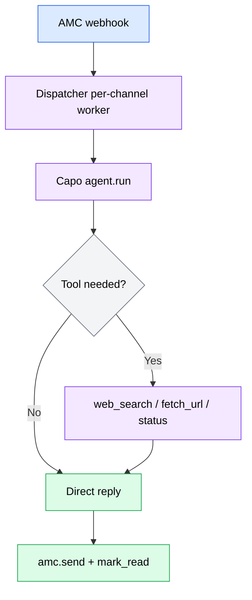
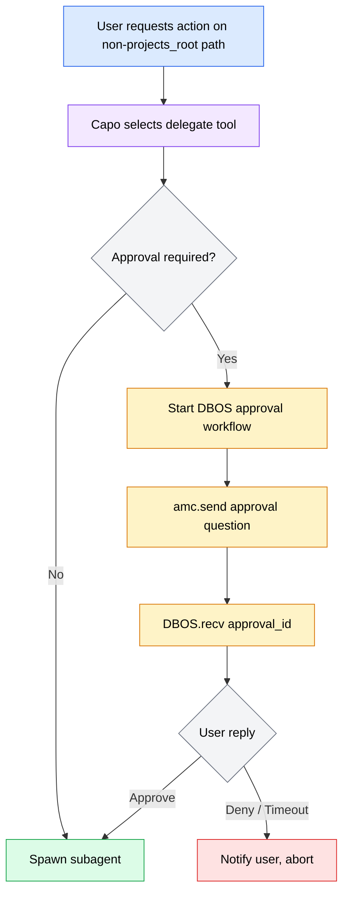
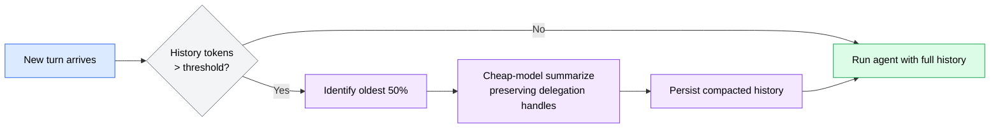
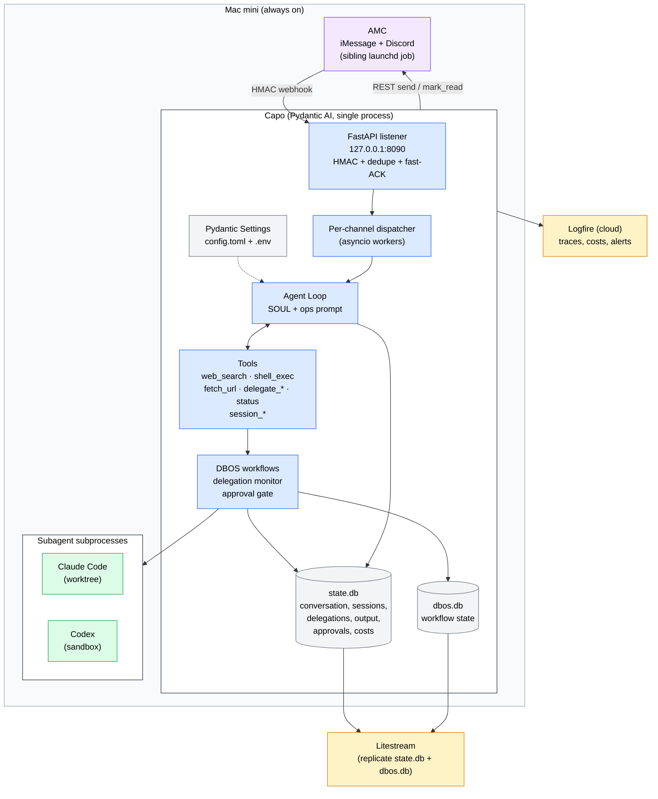
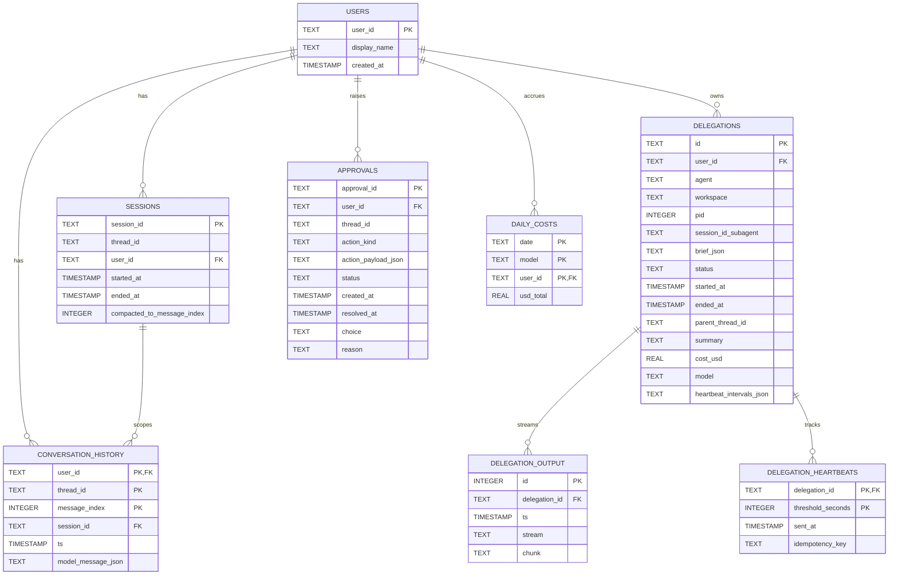
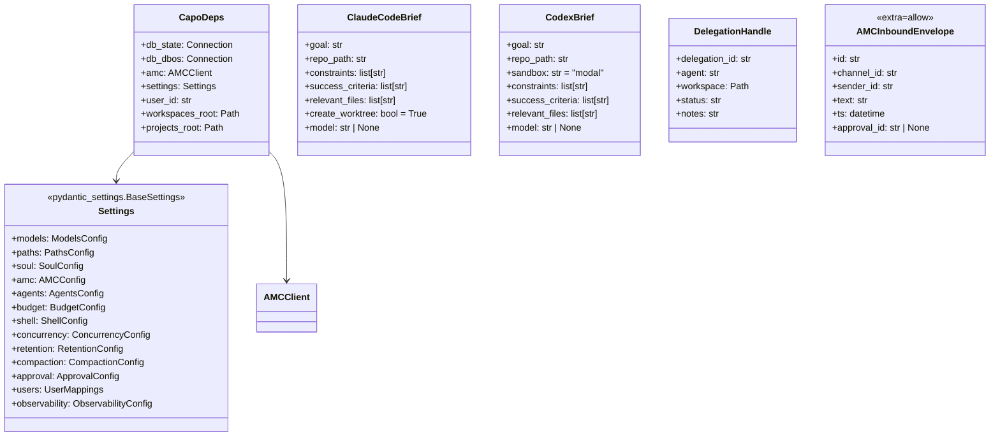
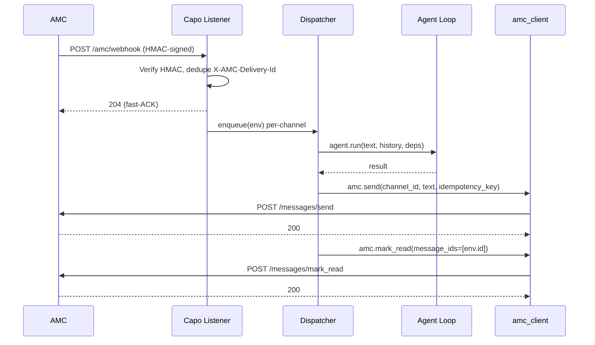
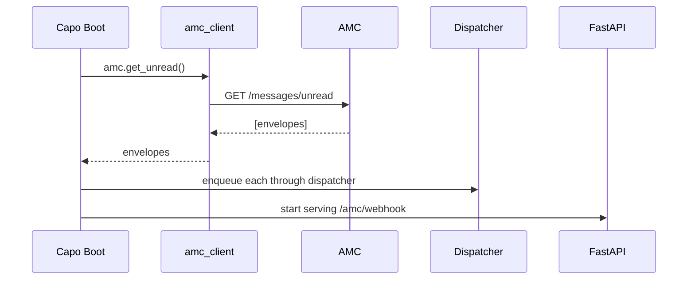

# Capo PRD

**Author**: Stephen Sequenzia
**Date**: 2026-05-10
**Status**: Draft
**Spec Type**: New product
**Spec Depth**: Full technical documentation
**Description**: Personal AI orchestrator on Mac mini that routes work via iMessage/Discord, handles trivial requests itself, and delegates real coding work to Claude Code / Codex while supervising long-running tasks across restarts. Built on Pydantic AI, DBOS, SQLite, and AMC. Source of truth: `internal/blueprints/capo-blueprint.md`.

---

## 1. Executive Summary

Capo is a single long-lived Python process that owns conversation state with one user (and later a small group), routes incoming messages to the right model, and delegates real work to subprocess coding agents (Claude Code, Codex) while supervising them through restart-resilient durable workflows. It uses AMC for messaging transport, DBOS for durable execution, SQLite for state (two files), and Logfire for observability. Every line is readable in an evening.

## 2. Problem Statement

### 2.1 The Problem

The user wants a single, always-on personal orchestrator that:
- Fields requests from any chat channel (iMessage, Discord) without per-channel logic in the orchestrator.
- Handles trivial requests itself (~5 minutes of work) and delegates real coding work to Claude Code or Codex.
- Survives reboots, OS updates, and API failures without losing track of in-flight delegations — including 90-minute coding runs.
- Stays small enough to read, modify, and own without depending on a framework's opinions.

No off-the-shelf product fits: agent SDKs cover the agent loop but not unbounded subprocess monitoring; coding agents (CC/Codex) are great executors but bad orchestrators; chat connectors are platform-specific and stateful. The right architecture is a small bespoke orchestrator built on a few solid primitives.

### 2.2 Current State

- Coding agents are invoked manually per task with no shared memory, no cross-task supervision, and no durable state across machine reboots.
- Chat platforms are siloed; there's no unified inbox the user can talk to from any device.
- Long-running tasks have no completion notification surface — the user has to remember to check.

### 2.3 Impact Analysis

- **Operational cost**: Manual context switching between platforms, manual task supervision, lost work on machine restarts.
- **Cognitive cost**: The user holds task state in their head.
- **Quality cost**: Mid-run failures are silent until the user manually checks.

### 2.4 Business Value

- Single source for orchestration over multiple coding agents, all chat channels, and cost telemetry.
- Owned end-to-end: no SaaS subscription beyond API tokens; total cost is predictable and capped.
- Foundation for future personal-agent automation (shared with a small group later) without painting into a corner.

## 3. Goals & Success Metrics

### 3.1 Primary Goals

1. **Survive long delegations across restarts.** A 90-minute Claude Code run started before a reboot resumes after the reboot, completes, and notifies the user.
2. **One conversation surface, many channels.** Inbound iMessage and Discord messages reach Capo via AMC with the same shape; outbound replies use the same path.
3. **Delegation is a tool call.** Spawning Claude Code or Codex is just another tool the agent can choose, with full telemetry and approval support.
4. **Predictable cost.** Daily soft/hard caps prevent surprises; cost is observable per delegation.
5. **Readable.** ~800 lines of Python + a handful of markdown files in `souls/` and `prompts/`.

### 3.2 Success Metrics

| Metric | Baseline | Target | Measurement | Phase |
|--------|----------|--------|-------------|-------|
| Restart resilience | None | 100% of in-flight delegations resume after process restart | Integration test: kill -TERM mid-run, restart, verify completion notification | Phase 3 |
| End-to-end echo latency (handler ACK) | N/A | < 1s P99 (webhook → 204) | Synthetic webhook timing test | Phase 1 |
| End-to-end conversation latency (reply visible) | N/A | < 10s P50 for trivial requests | Manual smoke test | Phase 1 |
| Subprocess output durability | N/A | 0% chunk loss across reboot | Integration test: streaming run + restart | Phase 3 |
| Daily cost cap accuracy | N/A | Soft cap downgrades model within 1 minute of crossing | Synthetic accounting test | Phase 5 |
| Lines of Python (excl. tests) | N/A | < ~800 LOC at Phase 5 close | `tokei capo/` | Phase 5 |

### 3.3 Non-Goals

- Multi-tenant SaaS with billing, user management UI, or role hierarchies.
- Replacing AMC's connector code or owning iMessage/Discord platform integration.
- Replacing Claude Code or Codex as primary coding agents.
- Vector memory / semantic recall in V1 (see Out of Scope).
- Running on anything but the Mac mini in V1.

## 4. User Research

### 4.1 Target Users

#### Primary Persona: Power User Owner

- **Role**: The author of Capo, sole V1 user.
- **Goals**: Delegate coding work from any chat surface; supervise long-running runs; control daily cost; audit every decision Capo makes.
- **Pain Points**: Manual context-switching between coding agents and chat; lost work on reboots; opaque costs.
- **Context**: Always-on Mac mini at home; iPhone and laptop as remote terminals via AMC.
- **Technical Proficiency**: Expert — comfortable editing Python, Markdown, TOML, `launchd` plists.

#### Secondary Persona: Small Group Member (Future)

- **Role**: A handful of trusted users sharing the same Capo instance later.
- **Goals**: Their own conversation history; their own delegation queue.
- **Pain Points**: Don't want to see each other's data.
- **Note**: V1 must not paint the schema or AMC integration into a single-user corner; per-`user_id` partitioning is required from Phase 1.

### 4.2 User Journey: Long Coding Delegation Survives Reboot

```mermaid
flowchart LR
    A["User texts: 'Refactor auth module in capo'"]:::primary
    B["AMC delivers signed webhook"]:::secondary
    C["Capo loads history,<br/>picks delegate_to_claude_code"]:::secondary
    D["Spawn CC in worktree,<br/>persist row, hand to DBOS"]:::secondary
    E["Mac mini reboots<br/>at minute 45"]:::warning
    F["launchd restarts Capo;<br/>DBOS resumes workflow;<br/>claude --resume <session_id>"]:::secondary
    G["CC finishes at minute 92"]:::success
    H["Workflow calls amc.send<br/>with completion summary"]:::success

    A --> B --> C --> D --> E --> F --> G --> H

    classDef primary fill:#dbeafe,stroke:#2563eb,color:#000
    classDef secondary fill:#f3e8ff,stroke:#7c3aed,color:#000
    classDef success fill:#dcfce7,stroke:#16a34a,color:#000
    classDef warning fill:#fef3c7,stroke:#d97706,color:#000
```



### 4.3 User Workflows

#### Workflow 1: Trivial Request (handled directly)



#### Workflow 2: Delegation with Approval



#### Workflow 3: Session Compaction



## 5. Functional Requirements

### 5.1 Feature: Agent Loop with SOUL + Ops Prompt

**Priority**: P0 (Critical)
**Complexity**: Medium
**Phase**: 1

#### User Story

**US-001**: As the user, I want Capo to have a consistent voice and a clear operational contract so it sounds like itself and routes work predictably.

#### Acceptance Criteria

- [ ] On boot, `capo/agent.py` reads `souls/<active>.md` (path from `config.toml [soul] active/dir`) and prepends it to `prompts/system.md`.
- [ ] The composite instructions string is constructed once per process; agent is created with `instructions=<composite>`.
- [ ] SOUL is **never** included in delegation briefs; `tools/claude_code.py` and `tools/codex.py` build prompts from `prompts/delegation_brief.md` + the structured Brief model only.
- [ ] Default model is read from `config.toml [models] default`; configurable via `config.toml` edit + restart. No per-run override in V1.
- [ ] At least two soul files (`default.md`, `concise.md`) exist as exemplars; switching is a config edit + restart.
- [ ] Unit test verifies SOUL absent from rendered delegation prompts.

#### Edge Cases

| Scenario | Input | Expected Behavior |
|----------|-------|-------------------|
| Active soul file missing | `[soul] active = "missing"` | Boot fails with clear error citing the path checked |
| `prompts/system.md` missing | File deleted | Boot fails with clear error |
| Soul file > 50 lines | Long file | Boot succeeds; warning logged ("SOUL is longer than recommended") |

---

### 5.2 Feature: AMC Webhook Listener + Dispatcher

**Priority**: P0 (Critical)
**Complexity**: High
**Phase**: 1

#### User Story

**US-002**: As the user, I want messages I send from any AMC-connected platform to reach Capo reliably and in order, with no lost or duplicated turns.

#### Acceptance Criteria

- [ ] FastAPI app exposes `POST /amc/webhook` bound to `127.0.0.1:8090`.
- [ ] **HMAC verification first.** Compute `sha256=<hex>` over raw body using `AMC_WEBHOOK_SECRET`; compare with `hmac.compare_digest` against `X-AMC-Signature`. Reject with `401` on mismatch before parsing or logging the body.
- [ ] **Fast-ACK contract.** After signature + dedupe, respond `204` within < 1s P99. Agent work happens in the dispatcher worker, not in the request handler.
- [ ] **Dedupe on `X-AMC-Delivery-Id`.** Maintain an LRU keyed by delivery-id covering at least 15 minutes of retries. Duplicate delivery-id returns `204` without enqueue.
- [ ] **Per-`channel_id` worker queue.** One asyncio worker per channel processes envelopes in arrival order. Different channels run in parallel.
- [ ] **Boot-time unread sweep.** Before serving the webhook, call `GET /messages/unread` on AMC, enqueue any unacked envelopes through the same dispatcher, then start the FastAPI server.
- [ ] Worker calls `amc.send` then `amc.mark_read` after the agent run completes; both are routed through `transport/amc_client.py`. `amc.mark_read` calls are idempotent on `message_id` and safe to retry.
- [ ] `X-Agent-ID: capo` header set on every outbound AMC request.

#### Edge Cases

| Scenario | Input | Expected Behavior |
|----------|-------|-------------------|
| Signature mismatch | Bad `X-AMC-Signature` | `401`, no body parsed, log signature-fail metric |
| Duplicate delivery | Same `X-AMC-Delivery-Id` within window | `204`, no enqueue, log dedupe-hit |
| AMC offline at boot | `GET /messages/unread` fails | Retry with backoff; serve webhook only after one successful sweep or after `max_boot_wait_seconds` (default 60s) — log a warning if proceeding without sweep |
| Long-running turn | Agent takes > 60s | Webhook already ACKed at 204; worker handles in background |
| Worker crash mid-turn | Exception during `agent.run` | Log + send error reply to channel + mark message read; do not crash the dispatcher |

#### Error Handling

| Error Condition | User Message | System Action |
|-----------------|--------------|---------------|
| AMC `RATE_LIMITED` | None (transparent) | Sleep `Retry-After`, retry send |
| AMC `PLATFORM_AUTH` | "Capo can't reach AMC — check your bearer token" | Log Logfire alert, do not retry |
| AMC `CHANNEL_NOT_FOUND` | "I can't reach that channel anymore" | Mark delegation orphaned, do not retry |
| AMC `ATTACHMENT_TOO_LARGE` (outbound `send` only — V1 does not handle inbound attachments) | "That attachment is too big for the channel" | Drop attachment, send text only |

---

### 5.3 Feature: Tool — `delegate_to_claude_code`

**Priority**: P0 (Critical)
**Complexity**: High
**Phase**: 2

#### User Story

**US-003**: As the user, I want Capo to delegate coding tasks to Claude Code in an isolated worktree so multiple delegations don't stomp each other.

#### Acceptance Criteria

- [ ] Tool accepts a `ClaudeCodeBrief` Pydantic model with: `goal`, `repo_path`, `constraints`, `success_criteria`, `relevant_files`, `create_worktree` (default `True`), `model` (optional — overrides config default for CC).
- [ ] Creates `~/.capo/workspaces/<delegation_id>/` directory before spawning.
- [ ] When `create_worktree=True`, creates a fresh worktree (`git worktree add <workspace> -b <delegation_id>`) off `worktree_base_branch` (default `main`).
- [ ] Spawns Claude Code as `claude -p <rendered_brief> --output-format json --permission-mode <config> [--model <X>]`; captures `session_id_subagent` from the first JSON event.
- [ ] **Persistence before yielding.** Insert `delegations` row with status `running`, `parent_thread_id`, `pid`, and nullable `session_id_subagent` before returning a user-visible handle.
- [ ] Start stdout/stderr/event capture immediately after spawn; when the first JSON event yields `session_id_subagent`, UPDATE the row in the same retry-helper write path.
- [ ] Hand off to the `monitor_delegation` DBOS workflow only after `session_id_subagent` is durable. If session ID capture times out, mark the row `failed`, kill the subprocess if still running, and return an explicit tool error.
- [ ] Returns a `DelegationHandle` with `delegation_id`, `agent="claude-code"`, `workspace`, `status="running"`, short `notes`.
- [ ] Rejects `repo_path` outside `projects_root` unless approval workflow returned approved (see §5.8).

#### Edge Cases

| Scenario | Input | Expected Behavior |
|----------|-------|-------------------|
| `repo_path` not a git repo | Path with no `.git` | `create_worktree=False` only; `True` errors with a clear message |
| `worktree_base_branch` doesn't exist | Repo with no `main` | Tool errors; user can override via config |
| Disk full mid-spawn | OS error | Row marked `failed` with reason; subprocess (if started) killed |
| Spawn timeout (CC binary missing) | `claude` not on PATH | Boot-time pre-check should catch; tool returns explicit error |
| Crash before session ID capture | Capo exits after spawn but before first JSON event | Boot recovery marks any `running` delegation with null `session_id_subagent` and no DBOS workflow as `failed` with reason "session id not captured"; notify only if `parent_thread_id` was already persisted |

---

### 5.4 Feature: Tool — `delegate_to_codex` (Full Parity)

**Priority**: P0 (Critical)
**Complexity**: High
**Phase**: 4

#### User Story

**US-004**: As the user, I want Codex available with the same tool surface as Claude Code so I can A/B compare, get second opinions, and use Codex-preferred sandboxes.

#### Acceptance Criteria

- [ ] `delegate_to_codex` accepts `CodexBrief` with `goal`, `repo_path`, `sandbox` (default from config), `constraints`, `success_criteria`, `relevant_files`, `model` (optional).
- [ ] Same lifecycle as CC: persist row → spawn → register DBOS workflow → return handle.
- [ ] `check_delegation_status`, `get_delegation_output`, `kill_delegation` work for Codex delegations identically.
- [ ] DBOS monitor uses the same `monitor_delegation` workflow, dispatching to a per-agent reader strategy (CC reads `--output-format json` events; Codex reads its equivalent — finalized after spike).
- [ ] Codex resume mechanism mirrors CC's `--resume <session_id>` contract. If the Codex CLI does not support session resume natively (see spike S-1), the spec is amended to a workaround before Phase 4 commits.
- [ ] **Phase 4 entry blocker.** Do not create or execute Codex implementation tasks until S-1 has amended §5.4 and §7.5 with the exact spawn invocation, event/output contract, resume mechanism, and fallback behavior if native resume is unavailable.

---

### 5.5 Feature: Tools — Status / Output / Kill / List

**Priority**: P0 (Critical)
**Complexity**: Low
**Phase**: 2

#### User Story

**US-005**: As the user, I want to ask Capo "what's running?", "what did delegation X say?", or "kill X" with no surprises.

#### Acceptance Criteria

- [ ] `check_delegation_status(delegation_id)` returns `{status, started_at, runtime_seconds, last_activity_ts, summary_one_line}`. Side-effect-free, callable freely.
- [ ] `get_delegation_output(delegation_id, tail_lines=200)` returns the latest `tail_lines` from `delegation_output` filtered by `stream IN ('stdout','event')`. Cap `tail_lines` at 1000.
- [ ] `kill_delegation(delegation_id, reason)` requires approval (see §5.8); on approval, sends SIGTERM to PID, marks row `killed`, persists reason, notifies user.
- [ ] `list_delegations(status=None, limit=20)` returns recent delegations for the current `user_id` only, ordered by `started_at DESC`.

---

### 5.6 Feature: DBOS Durable Monitoring + Restart Resume

**Priority**: P0 (Critical)
**Complexity**: High
**Phase**: 3

#### User Story

**US-006**: As the user, I want long delegations to survive Capo restarts and Mac reboots so I never lose work that's already been paid for in tokens.

#### Acceptance Criteria

- [ ] `monitor_delegation` is a `@DBOS.workflow()` with `delegation_id` as the deterministic input.
- [ ] **Continuous output drain.** A dedicated asyncio reader task per delegation drains subprocess `stdout` continuously into a batched buffer. Buffer flushes to `delegation_output` every ~50ms or ~100 chunks, whichever fires first. Reader is registered as a `@DBOS.step` so its progress is checkpointed.
- [ ] **Pipe-block-free.** Integration test verifies a chatty CC run (>10 MB of stdout) does not block the subprocess.
- [ ] Workflow polls subprocess `returncode` periodically; on completion, transitions status to `completed`/`failed`/`killed`.
- [ ] **Restart contract.** On process restart, DBOS re-enters the workflow from its last completed step. The workflow's first step on re-entry is to **re-spawn the subagent** via `claude --resume <session_id>` (CC) or the Codex equivalent. **Never re-attach by PID.**
- [ ] On completion, the workflow calls `summarize_run` (a `@DBOS.step` that invokes an LLM call producing a one-paragraph summary) and stores it on the `delegations` row.
- [ ] On completion, the workflow calls `notify_user` (a `@DBOS.step`) which sends the summary via `amc.send` using `parent_thread_id` from the delegations row. `notify_user` does **not** re-enter the agent loop.
- [ ] **All `@DBOS.step` calls with external side effects — subprocess spawn, `amc.send`, and any DB insert not already wrapped by the `BEGIN IMMEDIATE` retry helper — generate and persist an idempotency key in the workflow's step state so retries are safe.**
- [ ] DBOS state lives in `~/.capo/dbos.db` (separate SQLite file from `state.db`).

#### Edge Cases

| Scenario | Input | Expected Behavior |
|----------|-------|-------------------|
| Restart mid-spawn | Crash between subprocess spawn and DB row insert | DBOS workflow doesn't exist yet; row is the source of truth — if missing, delegation is lost (acceptable since user hasn't been told it started) |
| Restart between completion and `notify_user` | Workflow checkpoint after summarize, before notify | DBOS resumes, idempotency key on `notify_user` prevents double-send |
| Session-resume fails | `claude --resume <id>` returns error | Workflow marks delegation `failed` with reason "session resume failed"; notifies user |
| Subprocess orphaned and reaped by OS | macOS reaps orphan after several minutes | Resume via session-id succeeds regardless of PID state |

---

### 5.7 Feature: Conversation Memory (Per-Thread, Per-User)

**Priority**: P0 (Critical)
**Complexity**: Medium
**Phase**: 1 (basic), 5 (compaction)

#### User Story

**US-007**: As the user, I want Capo to remember the thread we're in until I clear it, and to compact intelligently when the context gets large.

#### Acceptance Criteria

- [ ] History stored using Pydantic AI's `ModelMessage` serialization directly. Schema: `(user_id TEXT, thread_id TEXT, session_id TEXT, ts TIMESTAMP, message_index INT, model_message_json TEXT)`.
- [ ] `thread_id` = `amc:<channel_id>`. Conversation history uniqueness is scoped by user: composite primary key `(user_id, thread_id, message_index)`.
- [ ] On each turn, load all messages for `(user_id, thread_id)` in the **current session** (see Session Control below), feed into `agent.run(... message_history=...)`.
- [ ] **Session boundary.** A session ends only when the user explicitly starts a new one (slash command `/new` or NL equivalent) — `sessions` table tracks `(user_id, thread_id, session_id, started_at, ended_at, compacted_to_message_index)`, with at most one active session per `(user_id, thread_id)`. V1 imposes no implicit timeout; idle-timeout-based rotation is a future iteration.
- [ ] **Compaction.** When the current session's history tokens exceed `compaction.threshold_tokens` (default 100,000): identify the oldest 50% of messages; call a cheap model (`config.models.router`) to summarize them into a single system message; **retain all messages that reference an active delegation handle (`cc-<id>` or `codex-<id>`) verbatim**, regardless of age; persist the compacted history; log a Logfire span `capo.memory.compact`.
- [ ] **Active delegation handle** = any delegation in `running` or `pending_approval` state at compaction time.
- [ ] User can read recent history via `/status` (current session message count and approximate token count).

---

### 5.8 Feature: Approval Flows

**Priority**: P0 (Critical)
**Complexity**: High
**Phase**: 4

#### User Story

**US-008**: As the user, I want Capo to ask before taking the riskiest actions, with the wait surviving restarts.

#### Acceptance Criteria

- [ ] Actions requiring approval in V1:
  1. `shell_exec` outside the allowlist (binary not in allowlist OR contains shell metacharacters OR uses `sudo`).
  2. Any `delegate_*` call where `repo_path` is outside `projects_root`.
  3. Any `kill_delegation` call.
- [ ] Implementation: each guarded action wraps the underlying logic in a DBOS workflow that does `DBOS.recv(approval_id, timeout=approval.timeout_seconds)`.
- [ ] `approvals` table mirrors workflow state: `(approval_id TEXT PK, user_id, thread_id, action_kind, action_payload_json, status, created_at, resolved_at, choice, reason)`. Approvals link to delegations (when applicable) only through `action_payload_json`; there is no foreign key from `approvals` to `delegations`.
- [ ] On guarded action:
  1. Insert `approvals` row with `status='pending'`.
  2. Send AMC question containing `approval_id` and labeled options (`approve`/`deny`).
  3. Workflow awaits `DBOS.recv(approval_id)`.
- [ ] On inbound webhook: dispatcher detects `approval_id` field in envelope (per AMC inbound contract addendum below) and calls `DBOS.send(approval_id, choice)` before normal turn processing.
- [ ] Timeout default: 30 minutes. On timeout, status `expired`, action aborted, user notified.
- [ ] Approval envelope shape:
  - **Outbound** (to user): `{ approval_id: str, prompt: str, options: list[str] }`
  - **Inbound** (from user): the user can reply with the choice text or with a slash command `/approve <id>` / `/deny <id>` for unambiguous reference.

#### Inbound Contract Addendum

Capo must parse approval replies from natural-language messages by matching either:
- A slash command (`/approve <id>` or `/deny <id>`), parsed before the agent loop.
- An exact option label from the most recent pending approval in the thread.

If ambiguous, ask a clarifying question.

---

### 5.9 Feature: Cost Caps + Model Routing

**Priority**: P1 (High)
**Complexity**: Medium
**Phase**: 5

#### User Story

**US-009**: As the user, I want Capo to keep daily spend predictable and to let me override when I genuinely need it.

#### Acceptance Criteria

- [ ] **Main agent model selection.** Capo's main agent uses `config.models.default` on every run. Changing the default is a `config.toml` edit + restart in V1.
- [ ] **Subagent model selection.** When the main agent calls `delegate_to_claude_code` or `delegate_to_codex`, it MAY include a `model` field on the brief. If absent, the subagent uses `config.models.subagents.claude_code` or `config.models.subagents.codex` respectively (with their own defaults).
- [ ] **Cost accounting.** A `cost_tracker` reads Logfire's per-run cost (or a custom per-call accumulator) and persists daily totals to a `daily_costs` table `(date, model, usd_total)`.
- [ ] **Pre-tool-call hook.** Before every `agent.run` and every `delegate_*` call, the hook checks the day's running total against `budget.soft_daily_usd` and `budget.hard_daily_usd`.
- [ ] **Soft cap behavior.** On crossing soft cap, swap `config.models.default` → `config.models.router` in-memory for the remainder of the day; send a one-line heads-up via AMC to `budget.notify_channel`.
- [ ] **Hard cap behavior.** On crossing hard cap, `capo.run` short-circuits with a "budget exceeded — reply 'override' to continue today" message. The dispatcher pre-parses inbound text (case-insensitive exact match on `override` or slash command `/override`) BEFORE the agent loop; on match, persist a row in `budget_overrides (date, user_id)` scoped to the current `user_id`, which unlocks the rest of the day and resets at local midnight.
- [ ] **Resets at local midnight.**
- [ ] **Delegation costs tracked separately.** Per-delegation cost is logged on the `delegations` row and surfaced in the completion notification, but does NOT count against Capo's daily total in V1 (capped separately per-delegation in a later spec).
- [ ] **Reconciliation.** Canonical cost source is Logfire (or the per-call accumulator when Logfire is unavailable). A nightly reconciliation step emits a `capo.budget.reconcile` span with `accumulator_usd`, `logfire_usd`, `drift_usd`. The ±$1 requirement in §6.4 is measured against this span.

---

### 5.10 Feature: Session Control + Slash Commands

**Priority**: P1 (High)
**Complexity**: Low
**Phase**: 5

#### User Story

**US-010**: As the user, I want zero-cost shortcuts for common control actions (new session, status, kill, clear) plus a natural-language fallback.

#### Acceptance Criteria

- [ ] Pre-parse inbound text for slash commands BEFORE the agent loop:
  - `/new` — End current session, start a new one. Clears in-memory history reference; older history retained on disk.
  - `/status` — Return current session info: messages, tokens, running delegations.
  - `/clear` — Same as `/new` but also marks current session history as compacted-out (a single "cleared by user" marker remains).
  - `/kill <delegation_id>` — Initiates `kill_delegation` (which triggers approval).
  - `/approve <approval_id>`, `/deny <approval_id>` — Approval shortcuts.
- [ ] Slash commands consume zero tokens (no agent call).
- [ ] Slash commands return the equivalent action result via `amc.send`.
- [ ] Natural-language fallback: if no slash command matched and the agent infers user intent maps to a control action, it can call a corresponding tool. Implementation: register `session_new`, `session_status`, `session_clear` as agent tools so NL routing is uniform.

---

### 5.11 Feature: Multi-User Support (User ID + Allowlist)

**Priority**: P1 (High)
**Complexity**: Low
**Phase**: 1

#### User Story

**US-011**: As the future small-group operator, I want every record partitioned by `user_id` so adding 2-3 more people is a config edit, not a refactor.

#### Acceptance Criteria

- [ ] Every domain table (`conversation_history`, `delegations`, `sessions`, `approvals`, `daily_costs`) has a `user_id TEXT NOT NULL` column.
- [ ] `CapoDeps` already includes `user_id`; dispatcher worker resolves `user_id` from envelope before invoking the agent.
- [ ] **AMC sender → user_id resolution.** `config.toml [users]` table maps AMC sender identifiers (e.g. `+15551234567`, `discord:user:123`) to internal `user_id` values. Unknown senders are rejected at the dispatcher (logged; AMC allowlist should also catch this).
- [ ] V1 ships with exactly one mapping; adding more is a config edit + restart.
- [ ] No multi-user management UI in V1.

---

### 5.12 Feature: Health Check Endpoint

**Priority**: P1 (High)
**Complexity**: Low
**Phase**: 5

#### User Story

**US-012**: As the operator, I want a probe I can hit from `launchd`, `monit`, or a remote uptime monitor.

#### Acceptance Criteria

- [ ] `GET /healthz` returns `200 OK` with JSON body:
  ```json
  {
    "status": "ok|degraded|error",
    "subsystems": {
      "db": "ok",
      "dbos": "ok",
      "amc": "ok",
      "dispatcher": "ok"
    },
    "uptime_seconds": 1234,
    "last_webhook_ts": "2026-05-10T12:34:56Z"
  }
  ```
- [ ] Returns `503` if any required subsystem is down.
- [ ] Subsystem checks:
  - `db` — `SELECT 1` against `state.db`.
  - `dbos` — Connection to DBOS state DB succeeds.
  - `amc` — Latest AMC ping or last successful send within configured staleness window (default 5 min).
  - `dispatcher` — Workers alive, queue depth < `concurrency.queue_depth_max` (default 100 per channel worker; see §15.3).

---

### 5.13 Feature: Live Progress Reporting

**Priority**: P2 (Medium)
**Complexity**: Low
**Phase**: 3 (heartbeat) / 5 (polish)

#### User Story

**US-013**: As the user, I want enough proactive signal that I know Capo is still working, without spam.

#### Acceptance Criteria

- [ ] **Heartbeat.** On crossing each configurable threshold (default 15 min, 1 hr, 4 hr), the workflow sends a one-line milestone update to `parent_thread_id`.
- [ ] **On-demand.** User asking "what's going on with X" routes to `check_delegation_status`; agent reply summarizes.
- [ ] **Final notification.** Always sent on completion regardless of duration.
- [ ] All proactive sends use idempotency keys derived from `(delegation_id, str(threshold_seconds))`, where the threshold list is captured from config at delegation start time and frozen on the `delegations` row so config edits don't affect in-flight idempotency.
- [ ] `delegations.heartbeat_intervals_json` stores the frozen threshold list; `delegation_heartbeats` records each sent threshold with `sent_at` and `idempotency_key`, keyed by `(delegation_id, threshold_seconds)`.

## 6. Non-Functional Requirements

### 6.1 Performance Requirements

| Metric | Requirement | Measurement |
|--------|-------------|-------------|
| Webhook handler ACK | P99 < 1s | Synthetic latency test |
| Conversation reply (trivial) | P50 < 10s | Smoke test |
| Subprocess output ingest | Zero loss + zero pipe blocking on ≥10 MB stdout | Integration test (Phase 3) |
| Concurrent delegations | Up to `concurrency.max_delegations` (config, default 3) without contention | Load test |
| SQLite write contention | Zero `SQLITE_BUSY` returned to user; retries internally | Stress test (parallel writes) |
| DB size growth | < 100 MB/week with default retention (7d raw chunks) | Daily disk metric |

### 6.2 Security Requirements

#### Authentication / Authorization

- **AMC ↔ Capo**: HMAC-SHA256 signature on every inbound webhook (`X-AMC-Signature: sha256=<hex>`); bearer token on every outbound REST call. Shared secret + token in `.env`.
- **User → Capo**: Allowlist of AMC senders maps to `user_id`. Non-allowlisted senders never reach Capo (rejected by AMC) and are additionally rejected by Capo's dispatcher as defense in depth.
- **Approval-required actions**: see §5.8. Approval state persists in DB + DBOS workflow.

#### Shell Execution Allowlist

- Default allowlist: `git`, `ls`, `rg`, `cat`, `pwd`, `which`, `head`, `tail`, `wc`, `find`, `du`, `df`, `uname`. Configurable via `config.toml [shell] allowlist`.
- Rejected patterns: shell metacharacters (`;`, `&&`, `||`, `|`, backticks, `$(`, `>`, `<`), `sudo`, paths outside `projects_root` and `workspaces_root`.
- Anything outside allowlist routes through approval flow.

#### Data Protection

- **At rest**: SQLite files unencrypted (single-user, single-machine; FileVault is the platform layer). Litestream targets are user-owned (local folder + private cloud bucket).
- **In transit**: localhost loopback (no TLS). If listener bind ever changes off-loopback, TLS becomes mandatory (enforced by config validator).
- **Secrets**: Never in `config.toml`. Only in `.env`. `.env` is `chmod 600` and `.gitignore`d. Settings validator MUST refuse to log secrets.

### 6.3 Scalability Requirements

- V1 target: single Mac mini, 1 user (forward-compat for ~5).
- DB migration triggers (when SQLite is replaced with Postgres) — see Out of Scope §8.2.

### 6.4 Reliability Requirements

| Metric | Requirement |
|--------|-------------|
| Process uptime | `launchd KeepAlive` restart on crash; target < 5s between crash and restart |
| Webhook backlog tolerance | Capo offline up to 13 min still recovers all AMC retries (boot-time unread sweep) |
| Delegation completion | 100% of running delegations either complete or are explicitly notified as failed/killed; none silently lost |
| Cost cap accuracy | Daily totals within ±$1 of Logfire-reported actual |

### 6.5 Observability Requirements

#### Logfire Span Taxonomy (Normative)

| Span name | When | Required attributes |
|-----------|------|---------------------|
| `capo.boot` | Process boot path | `version`, `pid`, `config_path` |
| `capo.amc.webhook.in` | Inbound webhook handler | `delivery_id`, `channel_id`, `signature_ok`, `dedupe_hit` |
| `capo.dispatcher.handle` | Per-channel worker turn | `thread_id`, `user_id`, `message_id` |
| `capo.agent.run` | Pydantic AI agent run | `thread_id`, `user_id`, `model`, `tokens_in`, `tokens_out`, `cost_usd` |
| `capo.tool.<name>` | Tool execution | `tool_name`, `result_status`. `<name>` is the agent-facing tool name as registered with Pydantic AI (snake_case), e.g., `capo.tool.delegate_to_claude_code`, `capo.tool.session_new`. |
| `capo.delegation.<agent>.spawn` | Subprocess spawn step | `delegation_id`, `agent`, `model`, `pid` |
| `capo.delegation.<agent>.monitor` | DBOS workflow body | `delegation_id`, `step_name` |
| `capo.delegation.<agent>.complete` | Completion step | `delegation_id`, `runtime_s`, `cost_usd`, `status` |
| `capo.amc.send` | Outbound AMC REST | `channel_id`, `idempotency_key`, `error_code` (if any) |
| `capo.memory.compact` | Compaction event | `thread_id`, `messages_summarized`, `tokens_before`, `tokens_after` |
| `capo.budget.cap` | Soft/hard cap hit | `cap_kind`, `usd_today`, `usd_limit` |
| `capo.approval.request` / `capo.approval.resolve` | Approval lifecycle | `approval_id`, `action_kind`, `choice` |

All spans propagate trace ID; all errors include exception class + message.

### 6.6 Accessibility Requirements

N/A for V1 — no human-facing UI beyond AMC chat messages.

## 7. Technical Architecture

### 7.1 System Overview



### 7.2 Tech Stack

| Layer | Technology | Justification |
|-------|------------|---------------|
| Language | Python 3.12+ | Pydantic AI is Python-native; user is Python-fluent |
| Agent framework | Pydantic AI | Native DI, tool registration, durable adapters, OTel-native instrumentation |
| Durable execution | DBOS | Lightest option; SQLite-backed state; supports `DBOS.recv` for approval gates |
| State store | SQLite (two files) | `state.db` for app state, `dbos.db` for workflow state |
| Migrations | Alembic | Alembic manages `state.db` only — DBOS owns its `dbos.db` schema |
| HTTP server | FastAPI | Minimal webhook listener; type-driven validation |
| Settings | Pydantic Settings | Validates `config.toml` + `.env` at boot; fail-fast on misconfig |
| Observability | Pydantic Logfire | One-line setup; cost telemetry; OTel-native if backend swap needed |
| Replication | Litestream | Continuous WAL streaming of `state.db` and `dbos.db` to local + cloud |
| Process supervision | `launchd` | macOS-native, `KeepAlive` + `RunAtLoad`, plist-defined |
| Subagent CLIs | Claude Code (`claude`), Codex (`codex`) | Spawned as subprocesses in worktrees / sandboxes |
| Messaging transport | AMC (HTTP webhook + REST) | Owns iMessage/Discord platform code; HMAC-signed envelopes |

### 7.3 Data Models

#### state.db Schema



**SQL definitions** (canonical):

```sql
-- Pragmas, run before any other SQL at boot:
PRAGMA journal_mode = WAL;
PRAGMA synchronous  = NORMAL;
PRAGMA fullfsync    = ON;
PRAGMA busy_timeout = 5000;
PRAGMA journal_size_limit = 67108864;
PRAGMA foreign_keys = ON;

CREATE TABLE users (
    user_id      TEXT PRIMARY KEY,
    display_name TEXT,
    created_at   TIMESTAMP NOT NULL DEFAULT CURRENT_TIMESTAMP
);

CREATE TABLE sessions (
    session_id                 TEXT PRIMARY KEY,
    thread_id                  TEXT NOT NULL,
    user_id                    TEXT NOT NULL REFERENCES users(user_id),
    started_at                 TIMESTAMP NOT NULL DEFAULT CURRENT_TIMESTAMP,
    ended_at                   TIMESTAMP,
    compacted_to_message_index INTEGER NOT NULL DEFAULT 0
);
CREATE UNIQUE INDEX idx_sessions_user_thread_active ON sessions(user_id, thread_id) WHERE ended_at IS NULL;

CREATE TABLE conversation_history (
    user_id            TEXT NOT NULL REFERENCES users(user_id),
    thread_id          TEXT NOT NULL,
    message_index      INTEGER NOT NULL,
    session_id         TEXT NOT NULL REFERENCES sessions(session_id),
    ts                 TIMESTAMP NOT NULL DEFAULT CURRENT_TIMESTAMP,
    model_message_json TEXT NOT NULL,
    PRIMARY KEY (user_id, thread_id, message_index)
);
CREATE INDEX idx_history_session ON conversation_history(user_id, session_id, message_index);

CREATE TABLE delegations (
    id                    TEXT PRIMARY KEY,
    user_id               TEXT NOT NULL REFERENCES users(user_id),
    agent                 TEXT NOT NULL CHECK (agent IN ('claude-code','codex')),
    workspace             TEXT NOT NULL,
    pid                   INTEGER,
    session_id_subagent   TEXT,
    brief_json            TEXT NOT NULL,
    status                TEXT NOT NULL CHECK (status IN ('running','completed','failed','killed','pending_approval')),
    started_at            TIMESTAMP NOT NULL DEFAULT CURRENT_TIMESTAMP,
    ended_at              TIMESTAMP,
    parent_thread_id      TEXT,
    summary               TEXT,
    cost_usd              REAL NOT NULL DEFAULT 0,
    model                 TEXT,
    heartbeat_intervals_json TEXT NOT NULL DEFAULT '[]'
);
CREATE INDEX idx_delegations_user_status ON delegations(user_id, status);
CREATE INDEX idx_delegations_started ON delegations(started_at DESC);

CREATE TABLE delegation_output (
    id            INTEGER PRIMARY KEY AUTOINCREMENT,
    delegation_id TEXT NOT NULL REFERENCES delegations(id),
    ts            TIMESTAMP NOT NULL DEFAULT CURRENT_TIMESTAMP,
    stream        TEXT NOT NULL CHECK (stream IN ('stdout','stderr','event')),
    chunk         TEXT NOT NULL
);
CREATE INDEX idx_output_delegation_ts ON delegation_output(delegation_id, ts);

CREATE TABLE delegation_heartbeats (
    delegation_id     TEXT NOT NULL REFERENCES delegations(id),
    threshold_seconds INTEGER NOT NULL,
    sent_at           TIMESTAMP NOT NULL DEFAULT CURRENT_TIMESTAMP,
    idempotency_key   TEXT NOT NULL,
    PRIMARY KEY (delegation_id, threshold_seconds)
);

CREATE TABLE approvals (
    approval_id         TEXT PRIMARY KEY,
    user_id             TEXT NOT NULL REFERENCES users(user_id),
    thread_id           TEXT NOT NULL,
    action_kind         TEXT NOT NULL,
    action_payload_json TEXT NOT NULL,
    status              TEXT NOT NULL CHECK (status IN ('pending','approved','denied','expired')),
    created_at          TIMESTAMP NOT NULL DEFAULT CURRENT_TIMESTAMP,
    resolved_at         TIMESTAMP,
    choice              TEXT,
    reason              TEXT
);
CREATE INDEX idx_approvals_pending ON approvals(status) WHERE status='pending';

CREATE TABLE daily_costs (
    date      TEXT NOT NULL,
    model     TEXT NOT NULL,
    user_id   TEXT NOT NULL REFERENCES users(user_id),
    usd_total REAL NOT NULL DEFAULT 0,
    PRIMARY KEY (date, model, user_id)
);
```

#### Retry Helper Contract

The `BEGIN IMMEDIATE` retry helper wraps every write path against `state.db`. Contract:

- On `sqlite3.OperationalError` whose message matches `database is locked`, retry with exponential backoff (initial 50ms, factor 2, jitter ±25%) capped at the `busy_timeout=5000ms` total wall time.
- On exhausting the retry budget, re-raise as `StoreUnavailable` (a typed exception surfaced to callers).
- Non-lock `OperationalError` and other exceptions propagate immediately without retry.

This helper is the canonical reference for the "retry helper" mentioned in §5.6, §6.1, and §7.6.

#### Pydantic Domain Models



### 7.4 API Specifications

Capo exposes **two HTTP endpoints**. Everything else is internal.

#### Endpoint: `POST /amc/webhook`

**Purpose**: Receive AMC envelopes for inbound messages.

**Authentication**: HMAC-SHA256 signature over raw body using `AMC_WEBHOOK_SECRET`.

**Headers (required)**:
- `X-AMC-Signature: sha256=<hex>`
- `X-AMC-Delivery-Id: <uuid>` — used for dedupe
- `Content-Type: application/json`

**Request body** (Pydantic `extra="allow"`):
```json
{
  "id": "string - message id",
  "channel_id": "string - e.g. '+15551234567' or 'discord:dm:123'",
  "sender_id": "string - platform-native sender ID",
  "text": "string - message body",
  "ts": "ISO8601 timestamp",
  "approval_id": "string | null - present if this is an approval reply"
}
```

**Responses**:

`204 No Content` — Accepted (signature OK, deduped, enqueued, or already seen).

`401 Unauthorized` — Signature mismatch.
```json
{ "error": { "code": "BAD_SIGNATURE", "message": "X-AMC-Signature does not match body HMAC" } }
```

**SLA**: P99 < 1s. Agent work happens asynchronously in the dispatcher worker, not in this handler.

---

#### Endpoint: `GET /healthz`

**Purpose**: Health check for monitoring (`launchd`, external monitors).

**Authentication**: None (loopback-only listener).

**Responses**:

`200 OK`
```json
{
  "status": "ok",
  "subsystems": {
    "db": "ok",
    "dbos": "ok",
    "amc": "ok",
    "dispatcher": "ok"
  },
  "uptime_seconds": 1234,
  "last_webhook_ts": "2026-05-10T12:34:56Z"
}
```

`503 Service Unavailable`
```json
{
  "status": "error",
  "subsystems": {
    "db": "ok",
    "dbos": "ok",
    "amc": "error: connection refused",
    "dispatcher": "ok"
  }
}
```

### 7.5 Integration Points

| System | Type | Protocol | Purpose | Auth |
|--------|------|----------|---------|------|
| AMC | External (sibling process) | HTTP webhook + REST | Inbound messages, outbound replies, unread sweep | HMAC + Bearer |
| Anthropic API | External | HTTPS / SDK | Claude Sonnet / Opus / Haiku for agent + summarization | API Key |
| OpenAI API | External | HTTPS / SDK | (Optional) GPT models for routing/specialized turns | API Key |
| Claude Code CLI | External (subprocess) | stdin/stdout JSON | Coding agent delegation | Inherits user's CC auth |
| Codex CLI | External (subprocess) | stdin/stdout / RPC | Coding agent delegation | Inherits user's Codex auth |
| Logfire | External | HTTPS | Trace/cost telemetry | API Key |
| Litestream | External (sibling process) | filesystem watch + S3 / local | Continuous replication of `state.db` and `dbos.db` | Bucket creds |

#### Integration: AMC

**Overview**: AMC owns iMessage/Discord platform code; Capo is one consumer.

**Inbound flow**:



**Boot-time unread sweep**:



**Error handling**:
- Retry policy: `amc_client` retries `RATE_LIMITED` honoring `Retry-After`. Non-retryable codes (`PLATFORM_AUTH`, `CHANNEL_NOT_FOUND`) raise typed exceptions.
- Idempotency: every outbound `send` includes a freshly-generated UUIDv4 `Idempotency-Key`.
- Boot sweep failure: retry with backoff up to `max_boot_wait_seconds` (default 60s); after that, proceed and log a warning.

**AMC REST Contract**:

All outbound Capo → AMC requests include `Authorization: Bearer $AMC_BEARER_TOKEN`, `X-Agent-ID: capo`, and `Content-Type: application/json`. Error responses use the shared shape `{ "error": { "code": string, "message": string, "retry_after_seconds": nullable int } }`.

| Endpoint | Request | Success Response | Idempotency | Retry Policy |
|----------|---------|------------------|-------------|--------------|
| `GET /messages/unread` | No body | `{ "messages": AMCInboundEnvelope[] }` where each envelope matches §7.4 plus any AMC passthrough fields | AMC may return the same message in later sweeps until `mark_read` succeeds | Retry transient 5xx and `RATE_LIMITED`; boot may proceed after `max_boot_wait_seconds` with warning |
| `POST /messages/send` | `{ "channel_id": str, "text": str, "reply_to_message_id": nullable str, "approval": nullable approval object }` | `{ "message_id": str, "channel_id": str, "status": "sent" }` | Required `Idempotency-Key`; same key must not send duplicate user-visible messages | Retry `RATE_LIMITED` honoring `Retry-After`; do not retry `PLATFORM_AUTH`, `CHANNEL_NOT_FOUND`, or `ATTACHMENT_TOO_LARGE` |
| `POST /messages/mark_read` | `{ "message_ids": list[str] }` | `{ "marked_read": list[str], "already_read": list[str] }` | Idempotent by `message_id`; repeated marks are successful no-ops | Retry transient 5xx and `RATE_LIMITED`; safe to retry after worker crash |

The nullable approval object for `/messages/send` has shape `{ "approval_id": str, "prompt": str, "options": list[str] }`.

Known AMC error codes: `RATE_LIMITED`, `PLATFORM_AUTH`, `CHANNEL_NOT_FOUND`, `ATTACHMENT_TOO_LARGE`, `VALIDATION_ERROR`, `INTERNAL_ERROR`.

#### Integration: Claude Code CLI

**Spawn invocation** (provisional until spike S-3 replaces `<some_capture_mechanism>` with the confirmed session-id capture contract):
```bash
claude -p "<rendered_brief>" \
       --output-format json \
       --permission-mode <config.agents.claude_code.default_permission_mode> \
       [--model <brief.model>] \
       --session-id-output <some_capture_mechanism>
```

**Resume invocation** (on DBOS workflow re-entry):
```bash
claude --resume <session_id> \
       --output-format json \
       [--model <brief.model>]
```

**Event schema** — captured by spike S-3 before Phase 2 implementation.

#### Integration: Codex CLI

Identical lifecycle; specifics finalized after spike S-1 (session resume mechanism). **Spec amendment is a Phase 4 entry criterion**: §5.4 and §7.5 must be updated with the resolved Codex spawn invocation, event-stream contract, and resume mechanism (or workaround) before Phase 4 deliverables begin. Do not create or execute Codex implementation tasks until that amendment lands.

### 7.6 Technical Constraints

| Constraint | Impact | Mitigation |
|------------|--------|------------|
| macOS pipe buffer ~64 KB | Subprocess blocks on full pipe | Continuous async reader task drains stdout into batched DB writes |
| AMC webhook 10s timeout, 5 retries over ~13 min | Long agent turns can't ACK in handler | Fast-ACK pattern; agent work in dispatcher worker |
| AMC dead-letters after 5 retries | Capo offline >13 min loses webhooks | Boot-time unread sweep |
| SQLite WAL single-writer | Concurrent writes contend | WAL + `BEGIN IMMEDIATE` + `busy_timeout=5000` + retry helper |
| Pydantic AI message_history opacity | Custom store must round-trip | Store raw `ModelMessage` JSON; verify via spike S-4 |
| Claude Code JSON event schema | May change between CC versions | Pin minimum CC version; spike S-3 confirms schema stability |
| DBOS + SQLite concurrent workflows | Workflow coordination on SQLite untested for our load | Spike S-2 validates before Phase 3 commit |
| Single-writer Postgres-grade durability not present | Restart edge cases | DBOS step idempotency + session-resume contract |
| launchd PATH | `claude`/`codex` may live in `/opt/homebrew/bin` (Apple Silicon) | Plist sets `PATH` explicitly to include Homebrew + venv |

## 8. Scope Definition

### 8.1 In Scope (V1, all phases)

- Single Python process, launchd-supervised.
- AMC inbound webhook + outbound REST per the AMC contract (HMAC, idempotency, dedupe, unread sweep).
- Per-channel dispatcher.
- Pydantic AI agent with SOUL + ops prompt; pluggable persona files in `souls/`.
- Tools: `web_search`, `shell_exec` (allowlisted), `fetch_url`, `delegate_to_claude_code`, `delegate_to_codex`, `check_delegation_status`, `get_delegation_output`, `kill_delegation`, `list_delegations`, session-control tools.
- DBOS durable workflows for delegation monitoring and approvals.
- SQLite state (two files: `state.db`, `dbos.db`).
- Pydantic AI `ModelMessage` conversation history with session boundary and hybrid compaction.
- Approval flow via DBOS + DB row for non-allowlisted shell, repos outside `projects_root`, `kill_delegation`.
- Cost caps (soft + hard daily) with model downgrade on soft.
- Pydantic Settings validation at boot.
- Logfire instrumentation per the span taxonomy.
- Litestream replication of `state.db` and `dbos.db`.
- Health-check endpoint.
- `launchd` plist with App Nap disabled and `caffeinate` while delegations active.
- Multi-user-ready schema with config-mapped AMC sender → `user_id`.
- Alembic migrations.

### 8.2 Out of Scope (V1)

- **Vector memory / pgvector** — Start flat-markdown-per-project; add only when recall demands it.
- **Postgres migration** — Stay on SQLite until: (a) a second long-lived process needs DBOS state, (b) vector memory commits to the same store, or (c) move off Mac mini to VPS.
- **Per-agent / per-delegation budget caps** — Daily total only in V1; per-delegation cap is a later spec.
- **Multi-user management UI** — Config-edit + restart is V1's UX.
- **Runtime SOUL swap** — Config + restart.
- **Capo-as-MCP-server** — Capo is a process, not an MCP server. Subagents can mount AMC's MCP wrapper.
- **TLS** — Loopback only in V1.
- **Sliding-window history truncation across sessions** — Sessions are explicit; cross-session retrieval is a later concern.
- **Approval delegation** — All approvals come from the single thread; no "ask the other user" delegation.
- **Cost prediction / budget forecasting** — Reactive caps only.

### 8.3 Future Considerations

- FTS5 search across past conversations (cheap recall before vector).
- Per-agent budget caps with weekly/monthly windows.
- Multi-Mac federation (Tailscale + Postgres + DBOS multi-instance).
- Replacing slash command parser with structured Pydantic AI tools end-to-end.
- Auto-spawning Codex as a "second opinion" pass after CC success.

## 9. Implementation Plan

Phases are vertical slices. Each phase is independently demoable and ships with the testing rigor in §10. A phase's checkpoint gate must pass before the next phase begins. Spikes feed their findings into the phase that depends on them.

### 9.0 Spikes (run in parallel before / during early phases)

| Spike | Question | Blocks | Output |
|-------|----------|--------|--------|
| **S-1: Codex session resume** | Does Codex CLI support `--resume <session_id>` or equivalent? If not, what's the workaround? | Phase 4 | Spec addendum to §5.4 + §7.5 |
| **S-2: DBOS + SQLite concurrent workflows** | Does DBOS handle ≥3 concurrent monitor workflows on SQLite without state corruption or pathological lock contention? | Phase 3 | Go/no-go for SQLite backend; fallback plan if no-go |
| **S-3: Claude Code JSON event schema** | Which event types and fields can we depend on for status, session_id capture, completion? Schema stability across recent CC versions? | Phase 2 | Event parser spec + minimum CC version pin |
| **S-4: AMC webhook end-to-end** | Validate HMAC verification, dedupe behavior under retry, mark_read idempotency, error code surfacing against a real AMC instance. | Phase 1 | Smoke-test harness reusable across phases |

Each spike produces a short markdown findings document committed under `internal/specs/spikes/`.

---

### 9.1 Phase 1: Foundation + Echo Path

**Completion Criteria**:
- User can send a message via iMessage/Discord → Capo receives via AMC webhook → agent runs with SOUL + ops prompt → reply is delivered via AMC.
- Restart-resilient at the listener level: AMC retries after Capo restart reach the agent without duplication, and unread messages queued while Capo was offline are processed on boot.
- Multi-user-ready schema is in place even though only one user is configured.

| Deliverable | Description | Tasks | Dependencies |
|-------------|-------------|-------|--------------|
| Project scaffold | `pyproject.toml`, layout per blueprint §"Project structure", basic logging | `capo/__init__.py`, `capo/main.py`, dependencies | — |
| Pydantic Settings | Validate `config.toml` + `.env` at boot; fail-fast errors | `capo/config.py`, Settings model | — |
| SQLite hardening | Pragmas applied at boot; `BEGIN IMMEDIATE` retry helper; batched-insert helper | `capo/memory/store.py` | — |
| Alembic setup | Migrations for `state.db`; initial migration creates all tables | `migrations/001_init.py` | SQLite hardening |
| SOUL + ops loader | Read soul + system.md, prepend, pass as `instructions=` | `capo/agent.py`, `souls/default.md`, `souls/concise.md`, `prompts/system.md` | Settings |
| AMC listener | FastAPI app, HMAC verify, dedupe LRU, fast-ACK | `capo/transport/amc_listener.py` | Settings |
| Per-channel dispatcher | asyncio worker per `channel_id`, ordered processing | `capo/transport/dispatcher.py` | Listener |
| AMC client | REST wrapper with idempotency keys, typed exceptions per error code, `X-Agent-ID` header | `capo/transport/amc_client.py` | Settings |
| Boot unread sweep | Drain unacked AMC messages through dispatcher before serving webhook | `capo/main.py` startup | AMC client + dispatcher |
| Basic agent | Pydantic AI Agent registered with `web_search`, `fetch_url` only | `capo/agent.py`, `capo/tools/basic.py` (web_search, fetch_url) | SOUL loader |
| Conversation memory (basic) | Per-thread `ModelMessage` persistence; load full session into runs | `capo/memory/conversation.py` | SQLite + schema |
| Session creation | Implicit on first message in a `thread_id`; `sessions` row inserted | `capo/memory/conversation.py` | Memory |
| Multi-user mapping | `[users]` table in config maps AMC sender → `user_id`; dispatcher resolves before agent run | Settings + dispatcher | Settings |

**Checkpoint Gate**:
- [ ] Spike S-4 (AMC webhook E2E) complete.
- [ ] All Phase 1 unit + integration tests pass.
- [ ] Manual demo: user texts "hi" via AMC; Capo replies. Webhook handler responds in < 1s (verified in Logfire).
- [ ] HMAC signature mismatch returns 401 and never reaches dispatcher.
- [ ] Duplicate `X-AMC-Delivery-Id` is deduped (verified via integration test).
- [ ] Restart with unread messages → all unread arrive at agent exactly once.
- [ ] Pydantic Settings boot-time validation rejects a `.env` missing `AMC_WEBHOOK_SECRET` with a clear error.
- [ ] Spec checklist for §5.1, §5.2, §5.7 (basic), §5.11 signed off.

---

### 9.2 Phase 2: Claude Code Delegation + Basic Supervision

**Completion Criteria**:
- Capo can spawn a Claude Code subagent in a worktree, persist the delegation, monitor it (in-process, not yet DBOS-durable), and surface status/output/kill via tools.
- Subprocess output is drained continuously without pipe blocking.

| Deliverable | Description | Tasks | Dependencies |
|-------------|-------------|-------|--------------|
| `ClaudeCodeBrief` model | Pydantic model + `delegation_brief.md` template | `capo/tools/claude_code.py`, `prompts/delegation_brief.md` | — |
| Worktree creator | `git worktree add` helper with cleanup on failure | `capo/tools/_worktree.py` | — |
| `delegate_to_claude_code` tool | Spawn CC, persist row before yield, return `DelegationHandle` | `capo/tools/claude_code.py` | Worktree + memory |
| Async output reader | Per-delegation asyncio task drains stdout/stderr into batched DB writes | `capo/tools/_subprocess.py` | Memory batched-insert |
| Session ID capture | Parse CC's first JSON event for session_id, UPDATE row | `capo/tools/claude_code.py` | Output reader, S-3 findings |
| Status/output/kill tools | `check_delegation_status`, `get_delegation_output`, `kill_delegation`, `list_delegations` | `capo/tools/delegations.py` | Delegation persistence |
| Agent tool registration | All new tools wired into agent | `capo/agent.py` | — |
| `shell_exec` (allowlisted) | Allowlist enforcement; metacharacter rejection; non-allowlist → raises ApprovalRequired exception (deferred to Phase 4) | `capo/tools/basic.py` | Settings |

**Checkpoint Gate**:
- [ ] Spike S-3 (CC JSON schema) complete.
- [ ] Phase 2 unit + integration tests pass.
- [ ] Integration test: chatty CC run producing >10 MB stdout completes without subprocess block.
- [ ] Status tool returns accurate state for running and completed delegations.
- [ ] Kill tool successfully terminates a running CC and marks row `killed` with reason.
- [ ] Manual demo: user texts "refactor X in repo Y"; Capo spawns CC, replies with delegation_id, completes within smoke-test scope.
- [ ] Spec checklist for §5.3, §5.5 signed off.

---

### 9.3 Phase 3: DBOS Durability + Restart Resume

**Completion Criteria**:
- The V1 success metric is satisfied: a 90-minute CC run survives a `launchd` restart and the user receives the completion notification.
- DBOS workflows manage all delegation monitoring; in-process monitoring from Phase 2 is replaced.
- All side-effecting steps use idempotency keys.

| Deliverable | Description | Tasks | Dependencies |
|-------------|-------------|-------|--------------|
| DBOS configuration | Configure DBOS to use `~/.capo/dbos.db` (DBOS manages its own schema) | `capo/workflows/__init__.py` | Settings |
| `monitor_delegation` workflow | Workflow body: read events, persist via batched buffer, check returncode | `capo/workflows/delegation.py` | DBOS configured |
| Idempotency framework | Step idempotency key generator + persistence; `amc.send` honors `Idempotency-Key` already | `capo/workflows/_idempotency.py` | — |
| Restart resume contract | On workflow re-entry, re-spawn CC via `claude --resume <session_id>`; on failure, mark `failed` and notify | `capo/workflows/delegation.py` | Session ID capture from Phase 2 |
| `summarize_run` step | LLM call producing one-paragraph summary; persist on `delegations` row | `capo/workflows/delegation.py` | DBOS |
| `notify_user` step | Send completion notification via `amc_client.send` with idempotency key; NEVER re-enters agent loop | `capo/workflows/delegation.py` | AMC client |
| Heartbeat step | Send milestone updates at configurable thresholds (15m / 1h / 4h) | `capo/workflows/delegation.py` | AMC client |
| Replace Phase 2 in-process monitor | `delegate_to_claude_code` now hands off to DBOS instead of asyncio task | `capo/tools/claude_code.py` | DBOS workflow |
| Workflow output retention | Wire batched-insert buffer into workflow step boundaries | `capo/workflows/delegation.py` | — |

**Checkpoint Gate**:
- [ ] Spike S-2 (DBOS + SQLite concurrent) complete and green-lit.
- [ ] Phase 3 unit + integration tests pass.
- [ ] **Success-metric integration test**: spawn CC with a slow 90-minute task, `kill -TERM` Capo at minute 45, `launchctl kickstart` it, verify CC completes and notification arrives.
- [ ] Restart with completed-but-not-notified workflow does NOT double-send (idempotency verified).
- [ ] Three concurrent CC delegations run in parallel without lock contention errors.
- [ ] Spec checklist for §5.6, §5.13 (heartbeat) signed off.

---

### 9.4 Phase 4: Codex Parity + Approval Flows

**Completion Criteria**:
- Codex available with full tool-surface parity with Claude Code.
- All three approval-required actions (non-allowlisted shell, out-of-`projects_root` delegations, `kill_delegation`) round-trip approval via AMC, with DBOS-durable wait.

| Deliverable | Description | Tasks | Dependencies |
|-------------|-------------|-------|--------------|
| Codex spawn + reader | `delegate_to_codex` tool; per-Codex output parsing | `capo/tools/codex.py` | Phase 3 infra, S-1 findings |
| Codex resume contract | Mirror CC's session resume — or apply S-1 workaround | `capo/workflows/delegation.py` updates | S-1 findings |
| `approvals` table + Alembic migration | Schema per §5.8 | `migrations/00X_approvals.py` | Alembic |
| Approval workflow | DBOS workflow: insert row → send AMC question → `DBOS.recv(approval_id)` → resolve | `capo/workflows/approval.py` | DBOS |
| Approval inbound routing | Dispatcher detects `approval_id` in envelope, calls `DBOS.send`, bypasses agent loop | `capo/transport/dispatcher.py` | Approval workflow |
| Slash-command parser for `/approve` / `/deny` | Pre-agent parser for unambiguous approval | `capo/transport/dispatcher.py` | — |
| `shell_exec` approval gating | Non-allowlisted invocations raise → approval workflow → conditional execute | `capo/tools/basic.py` | Approval workflow |
| Out-of-`projects_root` gating | `delegate_*` checks repo_path against `projects_root`; out-of-tree triggers approval | `capo/tools/claude_code.py`, `capo/tools/codex.py` | — |
| `kill_delegation` gating | Always requires approval | `capo/tools/delegations.py` | Approval workflow |

**Checkpoint Gate**:
- [ ] Spike S-1 (Codex resume) complete; resume contract documented.
- [ ] §5.4 and §7.5 amended with exact Codex spawn invocation, output/event contract, and resume/fallback behavior before implementation tasks begin.
- [ ] Phase 4 tests pass.
- [ ] Integration test: Codex delegation survives restart with resume contract.
- [ ] Integration test: `kill_delegation` triggers AMC approval, user replies `/deny`, action aborts, user notified.
- [ ] Integration test: non-allowlisted `shell_exec` triggers approval, timeout fires after configured window, action aborts.
- [ ] Spec checklist for §5.4, §5.5 (kill), §5.8 signed off.

---

### 9.5 Phase 5: Cost Caps + Observability + Polish

**Completion Criteria**:
- Daily cost caps enforced.
- Logfire span taxonomy implemented and queryable.
- Session-control slash commands + NL fallback live.
- Hybrid compaction operating.
- Health check, retention pruning, Litestream, launchd plist all in place.

| Deliverable | Description | Tasks | Dependencies |
|-------------|-------------|-------|--------------|
| Cost accountant | Reads Logfire (or per-call accumulator); maintains `daily_costs` table | `capo/budget/accountant.py` | Logfire setup |
| Pre-tool-call hook | Inspects daily total, applies soft/hard cap behavior | `capo/budget/hooks.py` | Accountant |
| Soft cap behavior | Swap default → router; AMC heads-up message | `capo/budget/hooks.py` | AMC client |
| Hard cap behavior | Short-circuit with override prompt; override unlocks | `capo/budget/hooks.py` | — |
| Logfire instrumentation | `logfire.configure()`, `logfire.instrument_pydantic_ai()`, custom spans matching taxonomy | `capo/main.py`, scattered span decorators | Logfire setup |
| Span taxonomy enforcement | Decorators / helpers producing the names + attributes in §6.5 | `capo/observability/spans.py` | Logfire |
| Session control: slash commands | Pre-agent parser for `/new`, `/status`, `/clear`, `/kill`, `/approve`, `/deny` | `capo/transport/dispatcher.py` | — |
| Session control: NL tools | `session_new`, `session_status`, `session_clear` registered as agent tools | `capo/tools/session.py` | — |
| Hybrid compaction | Token-counting + cheap-model summarization preserving active delegation handles | `capo/memory/compaction.py` | Conversation memory |
| Output retention pruning | Nightly job: delete `delegation_output` chunks > retention window; `wal_checkpoint(TRUNCATE)` | `capo/memory/retention.py` | — |
| Health check endpoint | `GET /healthz` with subsystem probes | `capo/transport/health.py` | All subsystems |
| Litestream config | `litestream.yml` replicating `state.db` and `dbos.db` to local + cloud bucket with paired restore instructions | `scripts/litestream.yml` | — |
| `launchd` plist | `com.you.capo.plist` with `KeepAlive`, `RunAtLoad`, App-Nap-disabled, PATH (incl. Homebrew) | `scripts/com.you.capo.plist` | — |
| `caffeinate` helper | Runs `caffeinate -i` while any delegation in `running` state | `capo/ops/caffeinate.py` | — |
| Operator runbook | Markdown runbook for common ops + incident response | `docs/runbook.md` | — |

**Checkpoint Gate**:
- [ ] Phase 5 tests pass.
- [ ] Integration test: synthetic cost accumulation crosses soft cap → model swap verified; crosses hard cap → override flow verified.
- [ ] Logfire dashboard shows all taxonomy spans for a representative end-to-end run.
- [ ] Slash commands route in zero-token paths; NL fallback works.
- [ ] Compaction triggers at configured token threshold, retains all active delegation handles, replaces older messages with a summary.
- [ ] Retention pruning empties old chunks and reclaims WAL space on schedule.
- [ ] `GET /healthz` returns 200 with all subsystems "ok" on a healthy boot.
- [ ] `launchd` plist boots Capo cleanly on Mac mini reboot.
- [ ] Litestream restore exercise: restore paired `state.db` + `dbos.db` from the same backup point; integration tests still pass.
- [ ] Spec checklist for §5.9, §5.10, §5.12, §5.13 (final notification), §6.5 signed off.

## 10. Testing Strategy

### 10.1 Test Levels

| Level | Scope | Tools | Required Coverage |
|-------|-------|-------|-------------------|
| Unit | Every tool, every helper, every Pydantic model | pytest, pytest-asyncio | All tools must have at least happy-path + one error-case test |
| Integration | AMC webhook flow, dispatcher ordering, DBOS resume, approval round-trip, subprocess output drain, compaction, retention pruning | pytest + real SQLite + mocked subagent (cheap-model mode for model calls) | All §5 features have at least one integration test asserting acceptance criteria |
| Smoke | End-to-end against real AMC + real (cheap) Anthropic/OpenAI models | Manual or scripted via slash commands | One per phase, gated on checkpoint approval |

### 10.2 Critical Path: Restart-Resilient Long Delegation

| Step | Action | Expected Result |
|------|--------|-----------------|
| 1 | User texts: spawn a long CC run | Delegation row inserted; webhook ACKed < 1s |
| 2 | At t+5s, verify DBOS workflow active | Workflow has captured session_id; output flowing |
| 3 | At t+45s, `kill -TERM` Capo | Process exits; subprocess survives (orphaned) |
| 4 | `launchctl kickstart` Capo | Process restarts; DBOS resumes workflow |
| 5 | Resume re-spawns CC with `--resume <id>` | CC continues from prior session |
| 6 | CC eventually completes | Workflow runs `summarize_run` + `notify_user`; AMC mock records exactly one `POST /messages/send` call for the completion notification (verified via `Idempotency-Key` header and call count) |
| 7 | User asks `/status` | No running delegations; last entry shows the completed run with cost |

### 10.3 Performance Test Plan

- **Webhook handler latency**: 1000 synthetic signed webhooks at 5 rps; assert P99 < 1s ACK.
- **Output ingest throughput**: synthetic subprocess emitting 100 MB stdout in 60s; assert zero pipe blocks; assert all chunks land in DB.
- **Concurrent delegations**: configured default (`concurrency.max_delegations = 3`) simultaneous synthetic CC delegations; assert no `SQLITE_BUSY` errors surface to user; assert all complete.
- **Concurrent delegation stress**: 5 simultaneous synthetic CC delegations as above-default stress coverage; assert the system either queues beyond the configured cap or completes without user-visible lock errors.
- **Compaction latency**: history at 110K tokens; assert compaction step < 5s with cheap model.

## 11. Deployment & Operations

### 11.1 Deployment Strategy

- **Topology**: Single Mac mini. Capo + AMC are two sibling `launchd` jobs. No staging environment; the user dogfoods on the production machine.
- **Rollout**: Manual `launchctl unload && launchctl load` after pulling latest. No canary; sole user is the operator.
- **Rollback**: Git revert + restart. State migrations are forward-only; rollback may require paired manual DB restore of `state.db` and `dbos.db` from Litestream.

### 11.2 Feature Flags

V1 keeps flagging minimal. Where a behavior switch is genuinely needed:

| Flag | Purpose | Default |
|------|---------|---------|
| `agents.codex.enabled` | Disable Codex delegation surface (e.g. if Codex CLI broken) | `true` after Phase 4 |
| `budget.enforcement_enabled` | Allow temporary disable of caps during debugging | `true` |
| `compaction.enabled` | Disable compaction for diagnostic purposes | `true` |

### 11.3 Monitoring & Alerting

Logfire alerts (configured against the Logfire alerts API):

| Metric | Threshold | Channel |
|--------|-----------|---------|
| Delegation failure rate | > 25% over 1h | AMC `notify_channel` |
| AMC `send` 5xx rate | > 10% over 15m | AMC + Logfire UI |
| Webhook signature failures | > 5 in 5m (possible attack) | AMC + Logfire UI |
| Daily cost approaching soft cap | At 75% of soft | AMC `notify_channel` |
| DBOS workflow failures | > 3 in 1h | AMC + Logfire UI |
| Listener handler P99 latency | > 2s for 5m | Logfire UI |

### 11.4 Runbook

The runbook (deliverable in Phase 5) covers at minimum:

- "Capo isn't responding" — check launchd status, check Logfire for last span, check AMC reachability.
- "A delegation is hung" — `/status`, then `get_delegation_output` tail, then `/kill` if needed.
- "Cost cap fired unexpectedly" — query `daily_costs`, check Logfire run costs, override via `override` reply.
- "Restore state.db and dbos.db from Litestream" — exact paired-restore commands + WAL handling.
- "Replace a SOUL file" — edit + restart.

## 12. Dependencies

### 12.1 Technical Dependencies

| Dependency | Owner | Status | Risk if Delayed |
|------------|-------|--------|-----------------|
| AMC running locally with webhook configured | User (operator) | Existing | Phase 1 cannot proceed |
| Anthropic API access | User | Existing | All phases (default model) |
| OpenAI API access | User | Optional | Required only if Codex / GPT models used |
| Claude Code CLI installed + authenticated | User | Existing | Phase 2 |
| Codex CLI installed + authenticated | User | Required by Phase 4 | Phase 4 |
| Logfire account | User | Existing (plugin enabled) | Phase 5 (observability), advisory earlier |
| Litestream binary | User | New install | Phase 5 |

#### Version Policy

| Dependency | Version Requirement | Validation |
|------------|---------------------|------------|
| Pydantic AI | Pinned in `pyproject.toml`/lockfile once Phase 1 starts; upgrades require conversation-history round-trip tests | Unit + integration tests for `ModelMessage` serialization |
| DBOS Python SDK | Pinned before Phase 3; S-2 records the validated SQLite backend version | Phase 3 DBOS concurrency/restart tests |
| Claude Code CLI | Minimum version established by S-3 and enforced at boot with `claude --version` | Boot-time pre-check fails fast if below supported version |
| Codex CLI | Minimum version established by S-1 and enforced at boot with `codex --version` when `agents.codex.enabled=true` | Boot-time pre-check fails fast if below supported version |
| Litestream | Minimum version recorded when Phase 5 restore exercise passes | Restore exercise must cover both `state.db` and `dbos.db` |

Dependency upgrades that affect persisted data, event streams, CLI resume, or workflow state require updating the relevant spike findings document under `internal/specs/spikes/` and rerunning the owning phase's integration tests.

### 12.2 Cross-Team Dependencies

None. Single-operator project. AMC is owned by the same operator but lives in its own repo (`/Users/ada/prod/amc`).

## 13. Risks & Mitigations

| Risk | Impact | Likelihood | Mitigation | Owner |
|------|--------|------------|------------|-------|
| Codex CLI lacks session-resume mechanism | High (breaks Codex parity contract) | Med | Spike S-1; fallback to "re-issue brief" or "skip Codex parity in V1" if no path found | Operator |
| DBOS + SQLite concurrent workflow correctness issues | High (V1 success metric depends on this) | Med | Spike S-2; fallback to Postgres-from-day-one if SQLite is unfit | Operator |
| Subprocess pipe blocking on chatty runs | High (silent hang) | Low | Continuous async reader + integration test for >10 MB stdout | Operator |
| Webhook timeout vs agent latency | Med (lost messages, retried duplicates) | Low | Fast-ACK pattern + dedupe on `X-AMC-Delivery-Id` | Operator |
| AMC offline >13 minutes loses webhooks | High (data loss) | Low | Boot-time unread sweep; alert if sweep ever returns > N messages | Operator |
| Approval round-trip latency > timeout | Med (action aborted unnecessarily) | Med | Configurable timeout; user can extend via reply | Operator |
| Claude Code JSON event schema changes | Med (parser breaks) | Med | Spike S-3 documents stable subset; pin CC minimum version | Operator |
| Cost cap accounting drift vs actual | Med (over-spending past soft cap) | Med | Reconcile with Logfire daily; alert on > 10% drift | Operator |
| Compaction loses critical context | Med (degraded responses on long sessions) | Med | Hybrid retains delegation handles verbatim; user can `/new` to escape | Operator |
| Pydantic AI `ModelMessage` schema changes in upgrade | Med (history unreadable post-upgrade) | Low | Versioned message envelope; integration test on each Pydantic AI upgrade | Operator |
| `launchd` PATH does not include Homebrew on Apple Silicon | Med (Capo can't find `claude`/`codex`) | High | Plist sets explicit PATH; boot-time pre-check for subagent binaries | Operator |
| Litestream restore inconsistency with DBOS state | Med (workflow state divergent from app state) | Low | Replicate both `state.db` and `dbos.db`; restore both from the same backup point; document recovery procedure | Operator |
| Single-process bottleneck | Low | Low | Acceptable for V1 single-user; horizontal scale is future Postgres + multi-instance | — |

## 14. Open Questions

| # | Question | Owner | Trigger | Default if Unresolved |
|---|----------|-------|---------|----------------------|
| 1 | Codex CLI: exact resume mechanism | Operator | Spike S-1 | Apply "re-issue brief" workaround in Phase 4 |
| 2 | DBOS on SQLite under our concurrent load: green or yellow? | Operator | Spike S-2 | Yellow → migrate plan to Postgres before Phase 3 |
| 3 | Stable subset of CC `--output-format json` event types | Operator | Spike S-3 | Pin minimum CC version observed working during spike |
| 4 | Compaction cheap-model selection (`router` vs dedicated `summarizer`) | Operator | Phase 5 spike | Use `config.models.router` |
| 5 | Concurrency cap default value (3 vs 5) | Operator | Phase 2 load test | 3 (per blueprint) |
| 6 | Heartbeat default thresholds | Operator | Phase 3 user feedback | 15m / 1h / 4h |
| 7 | Maximum number of pending approvals per thread | Operator | Phase 4 | Soft cap of 1 (queue further requests) |

## 15. Appendix

### 15.1 Glossary

| Term | Definition |
|------|------------|
| **AMC** | Agent Messaging Channel. Sibling process that owns iMessage/Discord platform connectors and exposes a normalized HTTP/webhook API. |
| **DBOS** | Durable execution framework used for delegation monitoring and approval gates. SQLite-backed in V1. |
| **Delegation** | A subprocess invocation of Claude Code or Codex managed by Capo, tracked in the `delegations` table and monitored by a DBOS workflow. |
| **Session** | A continuous run of conversation turns within a `thread_id`, bounded by user-initiated `/new` or `/clear` commands. |
| **SOUL** | Capo's persona file in `souls/<active>.md`. Prepended to `prompts/system.md` to form the agent's `instructions`. |
| **Thread** | A conversation channel keyed `amc:<channel_id>`. |
| **Worktree** | A git worktree at `~/.capo/workspaces/<delegation_id>` providing isolated working directory for a subagent. |
| **Approval workflow** | DBOS workflow that does `DBOS.recv(approval_id)` to durably wait for user response before executing a guarded action. |
| **Litestream** | Continuous-WAL replication daemon for SQLite; streams `state.db` and `dbos.db` to local + cloud bucket. |
| **WAL** | SQLite Write-Ahead Log journal mode; enables concurrent readers + single writer. |
| **HMAC** | Keyed hash signature used to authenticate AMC webhook payloads. |
| **Alembic** | Schema migration tool for `state.db`; one initial migration per phase as needed. |
| **Pydantic AI** | Agent framework Capo uses for tool registration, dependency injection, and OTel-native instrumentation. |
| **Logfire** | Pydantic's observability platform; receives traces, costs, and alerts per the §6.5 taxonomy. |

### 15.2 References

- Source blueprint: `internal/blueprints/capo-blueprint.md`.
- AMC repo: `/Users/ada/prod/amc`.
- AMC reference dispatcher: `/Users/ada/prod/amc/webhook-receiver/src/amc_receiver/dispatcher.py`.
- Pydantic AI documentation (Logfire-instrumented agents, durable adapters).
- DBOS Python SDK documentation.
- Litestream documentation.
- OpenClaw SOUL concept: https://docs.openclaw.ai/concepts/soul (structural inspiration only — no shared code).

### 15.3 Configuration Reference

Canonical `config.toml`:

```toml
[models]
default = "anthropic:claude-sonnet-4-6"
router  = "anthropic:claude-haiku-4-5"
heavy   = "anthropic:claude-opus-4-7"

[models.subagents]
claude_code = "anthropic:claude-sonnet-4-6"
codex       = "openai:gpt-5"

[paths]
workspaces_root = "~/.capo/workspaces"
projects_root   = "~/code"
db_path         = "~/.capo/state.db"
dbos_db_path    = "~/.capo/dbos.db"

[soul]
active = "default"
dir    = "souls"

[amc]
base_url              = "http://127.0.0.1:8080"
agent_id              = "capo"
listen_host           = "127.0.0.1"
listen_port           = 8090
max_boot_wait_seconds = 60

[agents.claude_code]
binary = "claude"
default_permission_mode = "acceptEdits"
worktree_base_branch = "main"

[agents.codex]
binary = "codex"
default_sandbox = "modal"

[budget]
soft_daily_usd = 25
hard_daily_usd = 75
notify_channel = "amc:default"

[shell]
allowlist = ["git","ls","rg","cat","pwd","which","head","tail","wc","find","du","df","uname"]

[concurrency]
max_delegations = 3

[retention]
delegation_output_days = 7

[compaction]
threshold_tokens = 100000
preserve_delegation_handles = true

[approval]
timeout_seconds = 1800

[heartbeat]
intervals_seconds = [900, 3600, 14400]

[users.owner]
amc_senders = ["+15551234567", "discord:user:123"]
display_name = "Owner"
# Note: the TOML key after `users.` is the literal `user_id` written to every domain table.

[observability]
logfire_enabled = true
```

### 15.4 Change Log

| Version | Date | Author | Changes |
|---------|------|--------|---------|
| Initial | 2026-05-10 | Stephen Sequenzia | Initial spec compiled from blueprint + adaptive interview |

---

*Document generated by SDD Tools*
